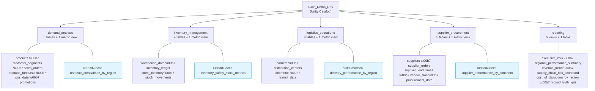
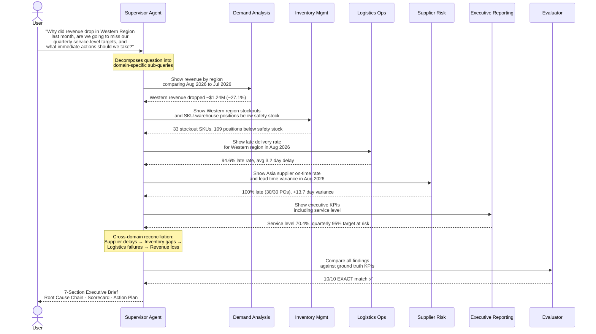

# Supply Chain Control Tower — Multi-Agent Genie Workshop

## What This Demo Proves

Enterprise data warehouses and data marts contain the answers to complex business questions — but AI agents often **hallucinate**, **misinterpret column names**, or **generate incorrect SQL** when querying that data. This demo shows how to build AI-powered data analysis agents on Databricks that are **grounded to business truth** and **consistently generate correct queries** across a multi-domain supply chain data warehouse — without hallucination.

Using a realistic supply chain scenario with 23 tables across 5 business domains, this workshop:

- Builds a **Supervisor Agent** that orchestrates 5 domain-specific **Genie Agents** to answer complex cross-domain business questions
- Starts at **30% accuracy** with a minimal baseline and progressively improves to **100% accuracy** across 6 iterations
- Demonstrates **why each improvement matters**: certified queries, column synonyms, agent instructions, supervisor hardening, metric views, and business definitions
- Shows that the last mile of accuracy requires **data governance** (formal business definitions, Unity Catalog tags, metric views) — not just better prompts

### What Are Genie Agents and Supervisor Agents?

**[Genie Agents](https://docs.databricks.com/en/genie/index.html)** (formerly called Genie Spaces) are AI-powered data analysis agents in Databricks. You give them access to specific tables, and they translate natural-language questions into SQL, execute the query, and return results. They can be enhanced with certified queries, column synonyms, and instructions to improve accuracy.

**[Supervisor Agents](https://docs.databricks.com/en/generative-ai/agent-framework/build-supervisor-agent.html)** orchestrate multiple sub-agents (including Genie Agents) as tools. The Supervisor receives a complex question, decides which sub-agents to call and in what order, synthesizes their results, and produces a unified answer. This enables cross-domain analysis that no single agent could perform alone.

##### Ground Truth: Demo Proxy for Real-World Feedback

> In this demo, we use a **ground truth table** — 10 pre-computed KPIs with known correct values — to objectively measure whether the agents are generating the right SQL and returning the right numbers. After each improvement iteration, we compare the Supervisor's output against ground truth and score it (EXACT / CLOSE / MISS).

> **In production, there is no ground truth table.** Instead, accuracy improves through an iterative **user feedback loop**:

1. A business user asks a question via a Genie Agent or Supervisor Agent
2. The agent generates SQL and returns a result
3. The user reviews the result and provides feedback: 👍 (correct) or 👎 (wrong)
4. A data team member reviews the feedback, identifies the root cause (wrong column, wrong filter, ambiguous metric), and applies a fix — exactly the same kinds of fixes shown in this demo (certified queries, synonyms, instructions, metric views)
5. Over time, the agent gets better and better at answering questions correctly

> **This demo compresses months of user-feedback-driven improvement into 6 scripted iterations**, so you can see the full journey in a single workshop session. Every fix we apply (certified queries, synonyms, metric views, business definitions) is the same fix a data team would apply in response to real user feedback.

---

## The Business Scenario

A **multi-regional retail company** sells 100 SKUs across 5 product families (Apparel, Accessories, Footwear, Home Goods, Electronics) through 4 US regions (Western, Eastern, Central, Southern). Products are sourced from 12 international suppliers across Asia, Europe, and North America, stored in 12 warehouses, and shipped via 8 carriers through 7 distribution centers.

The company's data warehouse is organized in [Unity Catalog](https://docs.databricks.com/en/data-governance/unity-catalog/index.html) with 5 domain schemas — each owned by a different business team — plus a shared `reporting` schema for cross-domain executive views.

### Data Model (Final State — after all 6 iterations)

The demo generates 23 base tables (~130K total rows) and progressively adds 5 metric views + 1 cross-domain view through the improvement iterations.



**Metric views** (blue) are pre-computed summaries added in iterations 5–6. They encode the exact business definition in the column name (e.g., `sku_warehouse_positions_below_safety_stock` instead of an ambiguous `COUNT(*)`) — this is what eliminates the last sources of agent error.

| Schema | Key Tables (bold = primary fact table) | Rows | Business Domain |
|--------|---------------------------------------|------|----------------|
| `demand_analysis` | products, customer_segments, **sales_orders**, demand_forecasts, pos_data, promotions | ~74K | Revenue, orders, demand forecasting |
| `inventory_management` | warehouse_data, **inventory_ledger**, store_inventory, stock_movements | ~15K | Stock levels, stockouts, safety stock |
| `logistics_operations` | carriers, distribution_centers, **shipments**, transit_data | ~38K | Delivery performance, delay tracking |
| `supplier_procurement` | suppliers, **supplier_orders**, supplier_lead_times, vendor_slas, procurement_data | ~1.7K | Supplier reliability, SLA penalties |
| `reporting` | executive_kpis, regional_performance_summary, revenue_trend, supply_chain_risk_scorecard, cost_of_disruption_by_region, ground_truth_kpis | Views | Cross-domain executive dashboards |

All data is generated with a **fixed reference date** of September 1, 2026 (`base_date = datetime(2026, 9, 1)`). "Last month" = August 2026, "Prior month" = July 2026. The demo produces identical results every run.

---

## The Two Test Prompts

### Prompt 1 — The Main Business Question (used for iterations 1–5)

> **"Why did revenue drop in the Western Region last month, are we going to miss our quarterly service-level targets, and what immediate actions should we take?"**

This question requires investigation across all 5 domains (demand, inventory, logistics, suppliers, executive KPIs). The Supervisor must call multiple Genie Agents, reconcile their findings, and produce a structured executive brief. After 5 iterations, the system achieves 100% accuracy on 10 ground truth KPIs.

### Prompt 2 — The Follow-Up That Breaks the System (used for iteration 6)

> **"What is our total Cost of Disruption by region last month — combining lost revenue from cancellations, at-risk backorder revenue, supplier SLA penalties, and wasted logistics spend on late shipments?"**

After reaching 100%, this new question **cannot be answered** because:
- "Cost of Disruption" is undefined in any schema, comment, synonym, or certified query
- It requires joining 3 schemas (`demand_analysis` + `logistics_operations` + `supplier_procurement`)
- No single Genie Agent has visibility across all three domains
- The Supervisor collects text answers — it cannot JOIN or SUM across agents

**Iteration 6** fixes this by creating a formal business definition (UC comments + tags), a cross-domain metric view, and a certified query — demonstrating that **data governance is the answer, not better prompts**.

## Architecture

```
Supervisor Agent ("Supply Chain Control Tower")
    ├─ Demand Analysis Agent        → Genie Agent (6 tables + 1 metric view)
    ├─ Inventory Management Agent   → Genie Agent (4 tables + 1 metric view)
    ├─ Logistics Operations Agent   → Genie Agent (4 tables + 1 metric view)
    ├─ Supplier Risk Agent          → Genie Agent (5 tables + 1 metric view)
    ├─ Executive Reporting Agent    → Genie Agent (4 views + 1 metric view)
    └─ Evaluator Agent              → Genie Agent (1 table: ground_truth_kpis)
```

### How the Supervisor Orchestrates a Query

When a user asks a business question, the Supervisor Agent breaks it down, routes sub-questions to domain-specific Genie Agents, collects their SQL-grounded answers, and synthesizes a unified executive brief.



## The Demo Story

A cascading supply chain failure:

1. **Asian suppliers** are 100% late (30/30 POs, +13.7 day average lead-time variance)
2. **Western inventory** collapses (33 stockouts, 109 SKU-warehouse positions below safety stock)
3. **Western logistics** breaks down (94.6% late delivery rate, 1,027 of 1,086 shipments late)
4. **Western revenue** drops ~$1.24M (-27.1%) as customers get backordered, partially fulfilled, or cancelled orders
5. **Company service level** falls to 70.4% — quarterly 95% target at CRITICAL RISK

The Supervisor Agent investigates all 5 domains and produces a structured executive brief with root cause analysis, cross-domain reconciliation, and a prioritized action plan.

---

## Quick Start

### Option A: One-Click Pipeline (recommended)

Run the master orchestrator notebook. It handles everything: teardown, data generation, agent creation, all 6 iterations, and verification.

| Notebook | Description |
|----------|-------------|
| `src/notebooks/00_run_all.py` | Runs teardown → create → generate → setup → all iterations → verify. Discovers the supervisor endpoint dynamically. |

Widgets:
- `catalog_name` (default: `GAP_Demo_Dev`)
- `warehouse_id` — set this to your SQL Warehouse ID
- `run_mode`: `full` (teardown + rebuild), `skip_teardown`, or `iterations_only`

The notebook runs `verify_ground_truth()` after each stage so you can see the accuracy progression live.

### Option B: Step-by-Step (for workshop presentation)

#### Prerequisites

- Databricks workspace with [Unity Catalog](https://docs.databricks.com/en/data-governance/unity-catalog/index.html) enabled
- A running [SQL Warehouse](https://docs.databricks.com/en/compute/sql-warehouse/index.html) (note the warehouse ID from the SQL Warehouses page)
- Permission to create catalogs, schemas, and tables
- Each script takes a `catalog_name` widget (default: `GAP_Demo_Dev`)
- `08_setup_genie_supervisor.py` also takes a `warehouse_id` widget

#### Step 1: Build the Data Layer (run once)

Open each notebook in the Databricks UI and **Run All**, in order:

| # | Script | What It Does | Time |
|---|--------|-------------|------|
| 1 | `src/01_create_catalog_schemas.py` | Creates catalog + 5 schemas | ~10s |
| 2 | `src/02_generate_demand_data.py` | 6 tables: products, customers, sales_orders, forecasts, POS, promotions | ~30s |
| 3 | `src/03_generate_inventory_data.py` | 4 tables: warehouses, inventory_ledger, store_inventory, stock_movements | ~20s |
| 4 | `src/04_generate_logistics_data.py` | 4 tables: carriers, distribution_centers, shipments, transit_data | ~20s |
| 5 | `src/05_generate_supplier_data.py` | 5 tables: suppliers, supplier_orders, lead_times, SLAs, procurement | ~20s |
| 6 | `src/06_create_reporting_views.py` | 4 views: executive_kpis, regional_performance, revenue_trend, risk_scorecard | ~10s |
| 7 | `src/07_add_all_comments.py` | Adds table + column comments (180+ columns) for Genie accuracy | ~30s |

**Result**: 19 tables + 4 views across 5 schemas in `GAP_Demo_Dev`.

#### Step 2: Create the Baseline Agents

| # | Script | What It Does |
|---|--------|-------------|
| 8 | `src/08_setup_genie_supervisor.py` | Creates 5 domain Genie Agents + 1 Evaluator Agent + ground truth table + Supervisor Agent with 6 tools |

Set the `warehouse_id` widget to your SQL Warehouse ID before running.

This creates a **deliberately minimal** baseline:
- Genie Agents have tables but **no** certified queries, synonyms, or enhanced instructions
- Supervisor has basic instructions — no structured format, no specific question phrasings
- Expected accuracy: **~30%** (3 of 10 ground truth metrics match)

**Test it now** — go to the [Agents playground](https://docs.databricks.com/en/large-language-models/llm-serving-intro.html) and send **Prompt 1** (the main business question from above). The Supervisor will try but produce inconsistent, partially incorrect results.

#### Step 3: Baseline Assessment (optional)

| # | Script | What It Does |
|---|--------|-------------|
| - | `src/improvements/iteration_01_baseline_assessment.py` | Runs ground truth SQL, documents correct values, shows what the baseline gets wrong |

This is read-only — it doesn't change any agents. It establishes the scoreboard.

#### Step 4: Progressive Improvement (the core demo)

Run each iteration notebook **in order**. After each one, invoke the Supervisor with **Prompt 1** to see the improvement.

##### Iteration 2: Certified Queries → ~20% accuracy (WORSE)

| # | Script | What It Does |
|---|--------|-------------|
| - | `src/improvements/iteration_02_certified_queries.py` | Adds 20 certified SQL queries across 5 domain Genie Agents |

**What changed**: Each Genie Agent now has pre-built SQL patterns with correct columns and calendar-month time windows.

**Why it got WORSE**: Certified queries only fire when the question matches the pattern. The Supervisor still asks vague questions like "Tell me about Western revenue" which don't trigger the certified SQL. The certified patterns may even confuse Genie when non-matching questions arrive.

**Key insight**: Optimizing sub-agents without optimizing the orchestrator is counterproductive.

##### Iteration 3: Enhanced Instructions + Synonyms → ~50% accuracy

| # | Script | What It Does |
|---|--------|-------------|
| - | `src/improvements/iteration_03_column_synonyms.py` | Adds enhanced domain instructions + 107 column synonyms to all 5 Genie Agents |

**What changed**:
- Enhanced instructions tell each agent: "last month = calendar month boundaries (DATE_TRUNC)"
- Schema notes: "shipments has destination_region, NOT region"
- 107 column synonyms: "revenue" → total_amount, "late" → is_late, etc.
- Logistics synonyms: "region" → destination_region

**Why it jumped to 50%**: Agents now understand time periods and correct columns. But the Supervisor still phrases some questions poorly.

##### Iteration 4: Supervisor Hardening → ~90% accuracy (9/10)

| # | Script | What It Does |
|---|--------|-------------|
| - | `src/improvements/iteration_04_supervisor_hardening.py` | Updates Supervisor instructions (7-section mandatory format) + tool descriptions with exact question phrasings |

**What changed**:
- Mandatory 7-section output format (Findings, Reconciliation, Root Cause Chain, Scorecard, Actions)
- Tool descriptions now mandate EXACT questions: e.g., "Show revenue by region comparing last month to prior month"
- Evaluator agent called LAST to validate all findings against ground truth
- Structured action tables with owners, targets, and timelines

**Why 90% (not 100%)**: The Supervisor asks the right questions and 9 of 10 metrics match exactly. However, "Western below safety stock" still misses: the Genie Agent returns 61 (COUNT DISTINCT sku_id) while ground truth is 109 (COUNT of all SKU-warehouse positions). This is a **metric definition ambiguity** that certified queries and synonyms alone cannot resolve.

##### Iteration 5: Metric Views + Business Glossary → 100% accuracy

| # | Script | What It Does |
|---|--------|-------------|
| - | `src/improvements/iteration_05_metric_views_glossary.py` | Creates 4 metric views, adds them to Genie Agents with certified queries, UC tags, and column-level examples |

**What changed**:
- 4 **metric views** with unambiguous column names (e.g., `sku_warehouse_positions_below_safety_stock` = 109)
- **Column comments with format examples** (e.g., "Example value: 109")
- **Table comments with business definitions** ("Use sku_warehouse_positions, not unique_skus")
- **UC Tags** for governance (`domain=inventory`, `metric_type=safety_stock`, `data_quality=authoritative`)
- Certified queries that reference metric views instead of base tables
- Updated inventory agent instructions to prefer the metric view
- Updated supervisor tool description to ask about "SKU-warehouse positions"

**Why 100%**: The metric view eliminates the ambiguity entirely. The column name IS the metric definition — there's no way for the agent to misinterpret `sku_warehouse_positions_below_safety_stock`.

**Key insight**: When a metric has multiple valid interpretations (COUNT vs COUNT DISTINCT), the only reliable fix is a **pre-computed metric view** that encodes the exact business definition in the column name itself.

##### Iteration 6: Cost of Disruption → 100% accuracy (11/11)

| # | Script | What It Does |
|---|--------|-------------|
| - | `src/improvements/iteration_06_cost_of_disruption.py` | Creates cross-domain CoD view + UC tags + rich business definitions + certified query + 11th ground truth |

**Now test Prompt 2** (the Cost of Disruption follow-up question from above). Before iteration 6, the system fails completely. After iteration 6, it returns the correct cross-domain metric.

**Key insight**: Even a 100%-accurate system breaks when asked a question involving an undefined business concept. The fix is governance — formal business definitions, cross-domain metric views, and UC documentation — not better SQL or smarter instructions.

#### Step 5: Run the Visual Demo

| # | Script | What It Does |
|---|--------|-------------|
| - | `src/10_demo_runner.py` | Generates plotly charts from live data + invokes the Supervisor + scores against ground truth |

Or invoke the Supervisor directly from the [Agents playground](https://docs.databricks.com/en/large-language-models/llm-serving-intro.html) with **Prompt 1** or **Prompt 2** from above.

> **Note on visualizations**: Genie Agents produce interactive charts when used standalone in the Genie UI. When called as tools by a Supervisor Agent via API, they return structured data tables. The `10_demo_runner.py` generates plotly charts from the same underlying data to provide the visual layer.

#### Step 6: Teardown (when done)

| # | Script | What It Does |
|---|--------|-------------|
| 9 | `src/09_teardown.py` | Deletes all Genie Agents, Supervisor Agent, and drops the entire catalog |

---

## Progressive Improvement Summary

| Stage | What Changed | UC Feature | Metrics Fixed | Score |
|-------|-------------|-----------|--------------|-------|
| **Baseline** | Bare tables, no semantic context | None | #8 (avg delay) | **~1-3/10** |
| **+ Column Comments** | 180+ column descriptions (Iter 1) | `ALTER TABLE SET COMMENT` | #4, #5 (inventory granularity) | **~3-5/10** |
| **+ Column Synonyms** | 107 business-to-technical mappings (Iter 2) | Genie `column_configs.synonyms` | #1, #3, #6, #7 (revenue, fill rate, vendor) | **~5-7/10** |
| **+ Certified SQL + Hardening** | SQL templates + supervisor routing (Iter 3) | `example_question_sqls` + instructions | #1 (MoM formula), #2 (OTD calc) | **~7-8/10** |
| **+ Metric Views + CoD** | Pre-computed views + cross-domain join (Iter 4) | `CREATE VIEW WITH METRICS LANGUAGE YAML` | #2, #4, #9 (OTD, safety stock, CoD) | **~9-10/10** |
| **+ UC Pages + Domains** | Business policies + domain organization (Iter 5) | UC Pages (manual from UI) | #10 (Q3 target = 95%) | **10/10** |

## Expected Output (after iteration 5)

The Supervisor produces a structured 7-section executive brief:

1. **What I Understood** — restates the business question
2. **Investigation Plan** — lists which agents to query and exact questions
3. **Findings by Agent** — for each of 5 agents: questions asked, SQL used, result summary, confidence
4. **Cross-Domain Reconciliation** — table comparing metrics across agents + ground truth
5. **Root Cause Chain** — numbered causal cascade: Supplier → Inventory → Logistics → Revenue → Service Level
6. **Ground Truth Comparison Scorecard** — 10-row table: Agent Finding vs Ground Truth vs Match
7. **Conclusion and Actions** — direct answer + immediate actions (table) + medium-term actions (table) + KPIs to monitor + risk assessment

## Complete Metric & UC Feature Matrix

This is the **authoritative reference** for every metric the demo tracks, why the agent fails without UC features, and which feature fixes it.

### The Core Problem: Business Terms ≠ Database Columns

When business users ask questions, they use **business vocabulary** ("revenue", "fill rate", "vendor penalties"). The database has **technical column names** (`total_amount`, `service_level_pct`, `penalty_amount`). Without UC Semantics, AI agents guess — and guess wrong.

| # | Business Term (in prompt) | What Agent Guesses | Correct Column/Table | Why It Fails | UC Feature Fix | Iteration |
|---|---|---|---|---|---|---|
| 1 | "revenue decline" | Looks for `revenue` column | `total_amount` in sales_orders | No column named revenue | Column Synonym | Iter 2 |
| 2 | "on-time delivery rate" | Computes OTD incorrectly | Inverse of `is_late` in shipments | Must compute `NOT is_late` as % | Synonym + Metric View | Iter 2 + Iter 4 |
| 3 | "fill rate" | Looks for `fill_rate` column | `service_level_pct` in executive_kpis | Different name entirely | Column Synonym | Iter 2 |
| 4 | "inventory positions below safety stock" | `COUNT(DISTINCT sku_id)` = 61 | `COUNT(*)` per SKU-warehouse row = 109 | Multiple rows per SKU (one per warehouse) | Column Comment (explains granularity) | Iter 1 |
| 5 | "SKUs stocked out" | `COUNT(*)` = 56 | `COUNT(DISTINCT sku_id)` = 33 | Opposite ambiguity to #4 | Column Comment (explains DISTINCT) | Iter 1 |
| 6 | "vendor SLA penalties" | Looks in wrong schema | `penalty_amount` in vendor_slas | "vendor" not in column/table names | Synonym: vendor→supplier | Iter 2 |
| 7 | "vendors delivered late" | Looks in wrong schema | `supplier_orders.is_late` | "vendor" not in supplier schema | Synonym: vendor→supplier | Iter 2 |
| 8 | "average delay" | Usually finds it | `delay_days` in shipments | Relatively direct mapping | Direct (baseline findable) | Baseline |
| 9 | "Cost of Disruption" | No such table/column exists | Cross-domain view joining 4 tables | Concept undefined anywhere in schema | Metric View (cross-domain) | Iter 4 |
| 10 | "Q3 service-level targets" | Guesses 90% or 95% | **95.0%** — defined in UC Page only | Business policy, not in any table | **UC Page** | Iter 5 (manual) |

### Primary Ground Truth Metrics (10 metrics — explicitly asked in prompt)

These are dynamically computed from live data and stored in `reporting.ground_truth_kpis`.

| # | Agent | Metric | Example GT Value | Source Table/View | Reference SQL | UC Feature Needed |
|---|---|---|---|---|---|---|
| 1 | demand-analysis | Western revenue MoM change (Aug vs Jul 2026) | -1240330.12 | demand_analysis.sales_orders | `SUM(total_amount) for Aug - SUM for Jul WHERE region='Western'` | Synonym: revenue→total_amount |
| 2 | logistics-operations | Western on-time delivery rate (Aug 2026) | 5.4 | logistics_operations.shipments | `ROUND(AVG(CASE WHEN NOT is_late THEN 1.0 ELSE 0.0 END)*100, 1)` | Synonym + Metric View |
| 3 | executive-reporting | Fill rate | 80.7 | reporting.executive_kpis | `SELECT service_level_pct` | Synonym: fill_rate→service_level_pct |
| 4 | inventory-management | Western below safety stock positions | 109 | inventory_management.inventory_ledger | `COUNT(*) WHERE below_safety_stock_flag AND region='Western'` | Comment (SKU-warehouse granularity) |
| 5 | inventory-management | Western stockout SKUs | 33 | inventory_management.inventory_ledger | `COUNT(DISTINCT sku_id) WHERE stockout_flag AND region='Western'` | Comment (COUNT DISTINCT) |
| 6 | supplier-risk | Total vendor SLA penalties (Aug 2026) | 1185043.1 | supplier_procurement.vendor_slas | `SUM(penalty_amount) WHERE is_breached=true` | Synonym: vendor→supplier |
| 7 | supplier-risk | Vendor late delivery pct (Aug 2026) | 75.0 | supplier_procurement.supplier_orders | `AVG(CASE WHEN is_late...) * 100` | Synonym: vendor→supplier |
| 8 | logistics-operations | Western avg delay days (Aug 2026) | 2.9 | logistics_operations.shipments | `AVG(delay_days) WHERE is_late AND dest_region='Western'` | Direct (baseline findable) |
| 9 | executive-reporting | Western Cost of Disruption | 3757298.31 | reporting.cost_of_disruption_by_region | Cross-domain join: cancelled rev + backorder rev + late freight + SLA penalties | Metric View (cross-domain, Iter 4) |
| 10 | executive-reporting | Q3 service-level target | 95.0 | **UC Page** (not in any table) | Business policy defined in UC Page | **UC Page** (Iter 5 — manual) |

> **Note**: Values are examples from current data. All are computed dynamically — no hardcoding.

### Indirect Ground Truth Metrics (derived from metric views and analysis)

These are NOT explicitly asked in the prompt, but appear in the agent's analysis as supporting data. Tracking them validates that the agent's SQL is correct beyond just the headline number.

| # | Category | Metric | Example Value | Source | Related Primary GT |
|---|---|---|---|---|---|
| 11 | Revenue | Western Aug revenue | 3341062.58 | sales_orders | #1 (MoM change) |
| 12 | Revenue | Western Jul revenue | 4581392.70 | sales_orders | #1 (MoM change) |
| 13 | Revenue | Western revenue % change | -27.1 | Derived | #1 (MoM change) |
| 14 | Logistics | Western late delivery rate | 94.6 | delivery_performance_by_region | #2 (OTD = inverse) |
| 15 | Logistics | Western total shipments (Aug) | 1086 | delivery_performance_by_region | #2 |
| 16 | Logistics | Western late shipments (Aug) | 1027 | delivery_performance_by_region | #2 |
| 17 | Logistics | Western wasted freight cost | (from view) | delivery_performance_by_region | #9 (CoD component) |
| 18 | Inventory | Western unique SKUs below safety | 61 | inventory_safety_stock_metrics | #4 (positions vs SKUs) |
| 19 | Inventory | Western avg days of supply (at-risk) | 1.0 | inventory_safety_stock_metrics | #4 |
| 20 | Supplier | Asia supplier late rate | 100.0 | supplier_performance_by_continent | #7 |
| 21 | Supplier | Asia avg lead time variance | 13.7 | supplier_performance_by_continent | #7 |
| 22 | Orders | Western fulfilled order % | 71.2 | sales_orders | Context |
| 23 | Orders | Western backordered orders | 275 | sales_orders | Context |
| 24 | Orders | Western cancelled revenue | 179419.26 | sales_orders | #9 (CoD component) |

---

## Metric View Inventory

Each metric view is a `CREATE VIEW WITH METRICS LANGUAGE YAML` object — a proper UC Metric View with dimensions, measures, and embedded synonyms. The `MEASURE()` syntax ensures Genie uses the pre-computed aggregation rather than guessing.

### 1. `logistics_operations.delivery_performance_by_region`

| Measure | Expression | Synonyms | Maps to GT # | Tracked? |
|---|---|---|---|---|
| `on_time_delivery_rate` | `ROUND(AVG(CASE WHEN NOT is_late...) * 100, 1)` | OTD rate, on-time rate, delivery rate | **#2** (Primary) | ✅ |
| `late_delivery_rate` | `ROUND(AVG(CASE WHEN is_late...) * 100, 1)` | late rate, late delivery percentage | **#14** (Indirect) | ✅ |
| `avg_delay_days` | `ROUND(AVG(CASE WHEN is_late THEN delay_days END), 1)` | average delay, mean delay days | **#8** (Primary) | ✅ |
| `total_shipments` | `COUNT(*)` | — | **#15** (Indirect) | ✅ |
| `late_shipments` | `SUM(CASE WHEN is_late THEN 1 ELSE 0 END)` | — | **#16** (Indirect) | ✅ |
| `wasted_freight_cost` | `ROUND(SUM(CASE WHEN is_late THEN shipping_cost ELSE 0 END), 2)` | wasted freight, late shipping cost | **#17** (Indirect) | ✅ |

**Dimension**: `region` (= `destination_region`). Synonym: "destination region", "ship to region", "delivery region".

### 2. `demand_analysis.revenue_comparison_by_region`

| Measure | Expression | Synonyms | Maps to GT # | Tracked? |
|---|---|---|---|---|
| `revenue_last_month` | `SUM(total_amount) WHERE Aug 2026` | revenue, sales last month | **#11** (Indirect) | ✅ |
| `revenue_prior_month` | `SUM(total_amount) WHERE Jul 2026` | revenue, sales prior month | **#12** (Indirect) | ✅ |
| `revenue_change_dollars` | `last - prior` | revenue decline, MoM change, revenue drop | **#1** (Primary) | ✅ |
| `revenue_change_pct` | `(last - prior) / prior * 100` | percent change | **#13** (Indirect) | ✅ |

**Dimension**: `region`, `product_family`.

### 3. `inventory_management.inventory_safety_stock_metrics`

| Measure | Expression | Synonyms | Maps to GT # | Tracked? |
|---|---|---|---|---|
| `positions_below_safety_stock` | `COUNT(*) WHERE below_safety_stock_flag` | below safety stock, inventory positions at risk | **#4** (Primary) | ✅ |
| `unique_skus_below_safety` | `COUNT(DISTINCT sku_id) WHERE below_safety_stock_flag` | SKUs below safety stock | **#18** (Indirect) | ✅ |
| `stockout_positions` | `COUNT(*) WHERE stockout_flag` | stockouts | Context | ✅ |
| `unique_skus_in_stockout` | `COUNT(DISTINCT sku_id) WHERE stockout_flag` | stockout SKUs | **#5** (Primary) | ✅ |
| `avg_days_of_supply` | `AVG(days_of_supply) WHERE below_safety_stock_flag` | days of supply | **#19** (Indirect) | ✅ |

**Dimension**: `region`.

### 4. `supplier_procurement.supplier_performance_by_continent`

| Measure | Expression | Synonyms | Maps to GT # | Tracked? |
|---|---|---|---|---|
| `total_purchase_orders` | `COUNT(*)` | total POs | Context | ✅ |
| `late_purchase_orders` | `SUM(CASE WHEN is_late...)` | late POs | Context | ✅ |
| `supplier_late_rate_pct` | `AVG(CASE WHEN is_late...) * 100` | vendor late rate, supplier late percentage | **#7** (Primary) | ✅ |
| `avg_lead_time_variance` | `AVG(lead_time_variance_days)` | lead time variance | **#21** (Indirect) | ✅ |

**Dimension**: `supplier_continent`.

### 5. `reporting.cost_of_disruption_by_region` (cross-domain)

| Measure | Expression | Maps to GT # |
|---|---|---|
| `cancelled_revenue` | `SUM(total_amount) WHERE order_status='Cancelled'` | **#24** (Indirect) |
| `backorder_revenue` | `SUM(total_amount) WHERE order_status='Backordered'` | Context |
| `wasted_freight` | `SUM(shipping_cost) WHERE is_late` | **#17** (shared) |
| `sla_penalties_allocated` | Proportional share of penalty_amount | Context |
| `total_cost_of_disruption` | Sum of all 4 components | **#9** (Primary) |

**Dimension**: `region`.

---

## UC Semantics Implementation Plan

The demo uses all 4 pillars of [Unity Catalog Semantics](https://learn.microsoft.com/en-us/azure/databricks/uc-semantics/) to ground AI agent responses:

| UC Feature | What It Does | How It's Created | Iteration |
|---|---|---|---|
| **Column Comments** | Tells agents what columns mean ("total_amount = total order revenue in USD") | `ALTER TABLE ... SET COMMENT` (automated) | Iter 1 |
| **Column Synonyms** | Maps business terms to technical names ("revenue" → total_amount) | Genie Agent `column_configs.synonyms` API (automated) | Iter 2 |
| **Certified Queries** | Pre-built SQL patterns for complex calculations (MoM change, OTD rate) | Genie Agent `example_question_sqls` API (automated) | Iter 3 |
| **Metric Views** | Pre-computed KPIs with unambiguous column names and `MEASURE()` syntax | `CREATE VIEW WITH METRICS LANGUAGE YAML` (automated) | Iter 4 |
| **Domains** | Business-aligned grouping of data assets on the Discover page | Created from Databricks UI (manual) | Iter 5 |
| **UC Pages** | Governed business definitions (policies, targets, formulas) that Genie One references authoritatively | Created from Databricks UI (manual) | Iter 5 |
| **Certification** | Marks assets as trusted — steers Genie toward vetted sources | `SET TAG ... certification_status = 'certified'` (automated) | Iter 4 |
| **Governed Tags** | Assigns assets to domains + adds metadata | `ALTER TABLE/SCHEMA SET TAGS` (automated) | Iter 4 |

### Domains (create from UI — Discover page)

Create these 5 domains in the Databricks Discover page. Each maps to one business team.

| Domain Name | Description | Schemas to Assign |
|---|---|---|
| **Supply Chain — Demand** | Revenue, orders, demand forecasting, promotions | `GAP_Demo_Dev.demand_analysis` |
| **Supply Chain — Inventory** | Stock levels, safety stock, stockouts, warehouse ops | `GAP_Demo_Dev.inventory_management` |
| **Supply Chain — Logistics** | Shipment tracking, delivery performance, carrier management | `GAP_Demo_Dev.logistics_operations` |
| **Supply Chain — Suppliers** | Supplier reliability, SLA compliance, procurement | `GAP_Demo_Dev.supplier_procurement` |
| **Supply Chain — Executive** | Cross-domain KPIs, financial impact, targets | `GAP_Demo_Dev.reporting` |

**Governed tags** (automated in iteration notebooks):
```sql
ALTER SCHEMA GAP_Demo_Dev.demand_analysis SET TAGS ('domain' = 'Supply Chain — Demand');
ALTER SCHEMA GAP_Demo_Dev.inventory_management SET TAGS ('domain' = 'Supply Chain — Inventory');
ALTER SCHEMA GAP_Demo_Dev.logistics_operations SET TAGS ('domain' = 'Supply Chain — Logistics');
ALTER SCHEMA GAP_Demo_Dev.supplier_procurement SET TAGS ('domain' = 'Supply Chain — Suppliers');
ALTER SCHEMA GAP_Demo_Dev.reporting SET TAGS ('domain' = 'Supply Chain — Executive');
```

### UC Pages (create from UI — within each Domain)

Create these Pages within their respective domains. Each defines a business concept that AI agents reference authoritatively.

#### Page 1: "Quarterly Service-Level Targets" (Domain: Supply Chain — Executive)

> **This Page is required for GT metric #10.** Without it, the agent cannot authoritatively answer "Are we going to miss our Q3 targets?" — it can compute the current service level (70.4%) from data, but the target (95%) is a business policy, not a data value.

```markdown
# Quarterly Service-Level Targets (Q3 2026)

Approved by: VP Operations, effective July 1 2026.

| KPI | Q3 Target | Measurement |
|---|---|---|
| Overall service level (fill rate) | **95.0%** | service_level_pct in executive_kpis |
| On-time delivery rate | **>80%** (i.e., late rate <20%) | Computed from shipments.is_late |
| Stockout SKUs | **0** | COUNT(DISTINCT sku_id) WHERE stockout_flag |
| Safety stock compliance | **>95%** of positions above safety stock | inventory_ledger.below_safety_stock_flag |
| Supplier on-time rate | **>85%** | supplier_orders.is_late |

These targets apply company-wide. Regional targets follow the same thresholds.
Q3 performance is measured as the average across July, August, and September 2026.
```

#### Page 2: "Cost of Disruption" (Domain: Supply Chain — Executive)

```markdown
# Cost of Disruption (CoD)

A composite financial metric measuring the total monetary impact of supply chain failures.

**Formula**: CoD = Cancelled Revenue + At-Risk Backorder Revenue + Wasted Freight + SLA Penalties

| Component | Definition | Source |
|---|---|---|
| Cancelled Revenue | Revenue from orders with status = 'Cancelled' | demand_analysis.sales_orders |
| At-Risk Backorder Revenue | Revenue from orders with status = 'Backordered' | demand_analysis.sales_orders |
| Wasted Freight | Shipping cost for late deliveries | logistics_operations.shipments WHERE is_late |
| SLA Penalties (allocated) | Penalty amounts from breached vendor SLAs, allocated by region proportional to late shipment share | supplier_procurement.vendor_slas WHERE is_breached |

The pre-computed view `reporting.cost_of_disruption_by_region` implements this formula.
CoD is reported per-region and company-wide.
```

#### Page 3: "Revenue" (Domain: Supply Chain — Demand)

```markdown
# Revenue

In our supply chain data model, **revenue** refers to the `total_amount` column in `demand_analysis.sales_orders`.
This represents the total order value in USD, regardless of fulfillment status.

**Synonyms**: revenue, sales, total sales, order value, order revenue
**Column**: `demand_analysis.sales_orders.total_amount`

Month-over-month (MoM) revenue change = SUM(total_amount) for current month minus SUM(total_amount) for prior month.
A negative MoM change means revenue **declined** (not increased).
```

#### Page 4: "On-Time Delivery" (Domain: Supply Chain — Logistics)

```markdown
# On-Time Delivery (OTD)

OTD rate = percentage of shipments where `is_late = false`.
Late delivery rate = percentage where `is_late = true` (inverse of OTD).

**Formula**: `ROUND(AVG(CASE WHEN is_late = false THEN 1.0 ELSE 0.0 END) * 100, 1)`

The pre-computed metric view `logistics_operations.delivery_performance_by_region` provides:
- `on_time_delivery_rate` (OTD)
- `late_delivery_rate` (inverse)
- `avg_delay_days` (for late shipments only)

**Important**: The shipments table uses `destination_region` (not `region`) for filtering.
```

#### Page 5: "Vendor vs Supplier" (Domain: Supply Chain — Suppliers)

```markdown
# Vendor / Supplier Terminology

In our data model, "vendor" and "supplier" are synonymous. All supplier data lives in the
`supplier_procurement` schema. Key tables:

- `supplier_orders` — purchase orders to suppliers (has `is_late`, `lead_time_variance_days`)
- `vendor_slas` — SLA compliance tracking (has `penalty_amount`, `is_breached`)
- `suppliers` — master data (has `supplier_continent`, `country`, `risk_tier`)

"Vendor SLA penalties" = `SUM(penalty_amount) FROM vendor_slas WHERE is_breached = true`
"Vendor late delivery %" = `AVG(CASE WHEN is_late...) * 100 FROM supplier_orders`
```

### Certification (automated via SQL)

All tables and views are certified in Iteration 4:
```sql
SET TAG ON TABLE catalog.schema.table_name `system`.`certification_status` = 'certified';
```
This steers Genie One toward these assets when resolving ambiguous questions.

---

## Updated Iteration Plan (00_run_all.py)

The master orchestrator runs 5 stages, each adding ONE category of UC feature:

| Stage | Cell | UC Feature Added | Metrics Fixed | Expected Score |
|---|---|---|---|---|
| **Baseline** | Cell 6 | None — bare tables, no semantic enrichment | #8 (avg delay) | ~1-3/10 |
| **Iter 1** | Cell 8 | Column/Table **Comments** (180+ descriptions) | #4 (safety stock), #5 (stockout SKUs) | ~3-5/10 |
| **Iter 2** | Cell 9 | Column **Synonyms** (107 mappings) | #1 (revenue), #3 (fill rate), #6 (SLA penalties), #7 (vendor late) | ~5-7/10 |
| **Iter 3** | Cell 10 | **Certified Queries** + Supervisor Hardening | #1 (MoM formula), #2 (OTD calc) | ~7-8/10 |
| **Iter 4** | Cell 11 | **Metric Views** + CoD + Certification + Governed Tags | #2 (OTD via view), #4 (authoritative count), #9 (CoD) | ~9-10/10 |
| **Iter 5** | (manual) | **UC Pages** + **Domains** (created from UI) | #10 (Q3 target — only answerable from Page) | 10/10 |

**Key design principle**: Each iteration adds ONE type of UC feature. The progression proves that **data governance → better AI answers**.

### What Each Iteration Does NOT Fix

| Stage | What Still Fails | Why |
|---|---|---|
| Baseline | Almost everything — agents guess from column names alone | No semantic context |
| After Iter 1 (Comments) | Revenue, fill rate, vendor terms, OTD, CoD | Comments explain columns but don't map business terms to technical names |
| After Iter 2 (Synonyms) | MoM formula, OTD calculation, CoD | Agents know WHICH column but not HOW to compute derived metrics |
| After Iter 3 (Certified SQL) | CoD, possibly OTD (complex inverse calc) | Cross-domain joins impossible for single-domain agents |
| After Iter 4 (Metric Views) | Q3 target (95% is a policy, not data) | Business policies aren't in any table — need UC Pages |

> **Note**: All time-based metrics include actual month names (e.g., "Aug 2026 vs Jul 2026 MoM") generated dynamically via `DATE_FORMAT`. The demo works regardless of when it is run.

## File Structure

```
├── databricks.yml                               # DAB config (catalog, warehouse per env)
├── README.md                                    # This file
├── resources/
│   └── supply_chain_job.yml                     # Job definition (optional DAB deployment)
└── src/
    ├── 01_create_catalog_schemas.py              # Catalog + 5 schemas
    ├── 02_generate_demand_data.py                # 6 demand tables (~74K rows)
    ├── 03_generate_inventory_data.py             # 4 inventory tables (~15K rows)
    ├── 04_generate_logistics_data.py             # 4 logistics tables (~38K rows)
    ├── 05_generate_supplier_data.py              # 5 supplier tables (~1.7K rows)
    ├── 06_create_reporting_views.py              # 4 cross-domain views
    ├── 07_add_all_comments.py                   # 180+ column comments
    ├── 08_setup_genie_supervisor.py              # Raw baseline: 6 Genie Agents + Supervisor
    ├── 09_teardown.py                            # Full cleanup
    ├── 10_demo_runner.py                         # Charts + supervisor invocation + scoring
    ├── improvements/
    │   ├── iteration_01_baseline_assessment.py    # Ground truth + error documentation
    │   ├── iteration_02_certified_queries.py      # 20 certified SQL patterns
    │   ├── iteration_03_column_synonyms.py        # 107 synonyms + enhanced instructions
    │   ├── iteration_04_supervisor_hardening.py   # 7-section format + exact phrasings
    │   ├── iteration_05_metric_views_glossary.py  # Metric views + UC tags + examples
    │   └── iteration_06_cost_of_disruption.py     # Cross-domain CoD view + UC governance
    └── notebooks/
        ├── 00_run_all.py                          # One-click full pipeline orchestrator
        └── expected_output_reference.py           # Reference output for validation
```

## Data Determinism

All data generation scripts use a **fixed reference date** (`base_date = datetime(2026, 9, 1)`) and fixed random seeds (42/43/44/45), following the same approach as standard Databricks training demos. This produces **identical data every run**, regardless of when the demo is executed.

"Last month" = August 2026, "Prior month" = July 2026. All SQL views, certified queries, Genie Agent instructions, and ground truth use `DATE '2026-09-01'` instead of `CURRENT_DATE()`, so the demo is fully self-contained and never needs data regeneration.

---

## Configuration

Edit `databricks.yml` to set per-environment values:

- `catalog_name`: Unity Catalog name (default: `GAP_Demo_Dev`)
- `warehouse_id`: SQL Warehouse ID for Genie Agents

## Technical Notes

- **"Last month" = calendar month**: All SQL uses `DATE_TRUNC('month', ADD_MONTHS(CURRENT_DATE(), -1))` for last month and `-2` for prior month. Never rolling 30-day windows.
- **Genie API race condition**: After creating a Genie Agent, tables may not persist on the first PATCH. Scripts include retry logic.
- **Metric ambiguity**: When base tables have multiple rows per entity (e.g., one SKU in 3 warehouses), `COUNT(*)` and `COUNT(DISTINCT)` give different answers. Metric views resolve this by encoding the exact definition in the column name.
- **Tables must be sorted alphabetically** in `serialized_space.data_sources.tables`.
- **Supervisor requires a `description` field** or invocation fails.
- **Endpoint name format**: `mas-{short-uuid}-endpoint` (first 8 chars of the supervisor UUID).
- **Shipments table**: Has `destination_region` and `origin_region` but NO `region` column — this is the #1 trap.
- **Supplier data**: Organized by `supplier_continent` (Asia/Europe/North America), NOT by domestic region.

---

## Learn More

- **[Genie Agents](https://docs.databricks.com/en/genie/index.html)** — AI-powered data analysis agents that translate natural-language questions into SQL
- **[Supervisor Agents](https://docs.databricks.com/en/generative-ai/agent-framework/build-supervisor-agent.html)** — Multi-agent orchestrators that coordinate multiple sub-agents as tools
- **[Unity Catalog](https://docs.databricks.com/en/data-governance/unity-catalog/index.html)** — Unified governance for data and AI assets on Databricks
- **[SQL Warehouses](https://docs.databricks.com/en/compute/sql-warehouse/index.html)** — Serverless or provisioned compute for running SQL queries
- **[Databricks Agent Framework](https://docs.databricks.com/en/generative-ai/agent-framework/index.html)** — End-to-end tools for building, deploying, and monitoring AI agents
- **[Certified Queries](https://docs.databricks.com/en/genie/certified-queries.html)** — Pre-built SQL patterns that ground Genie Agent responses
