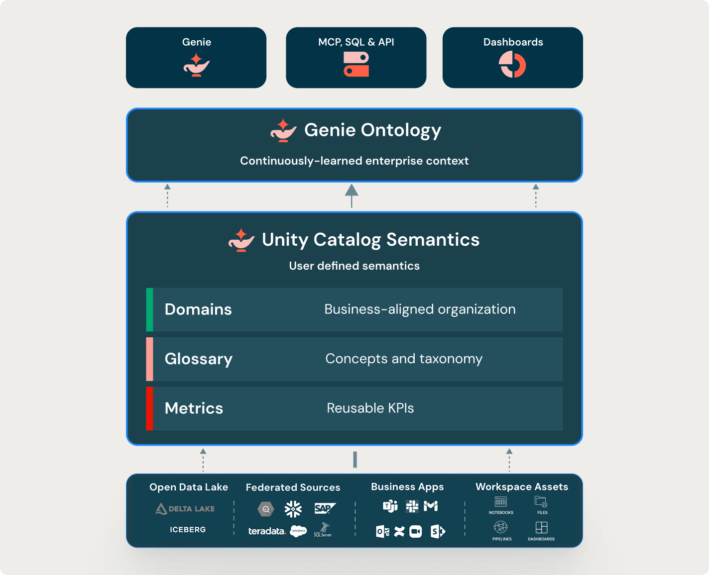
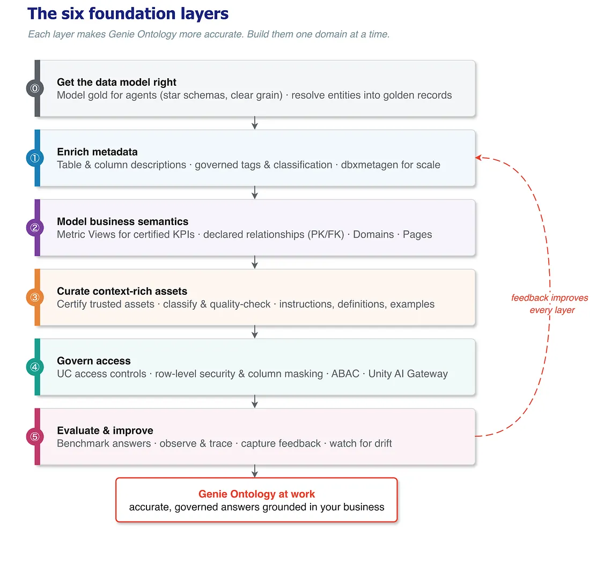
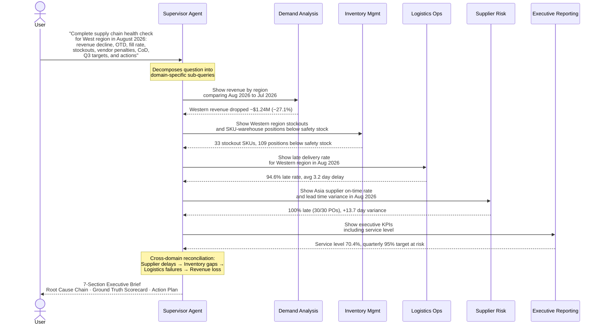
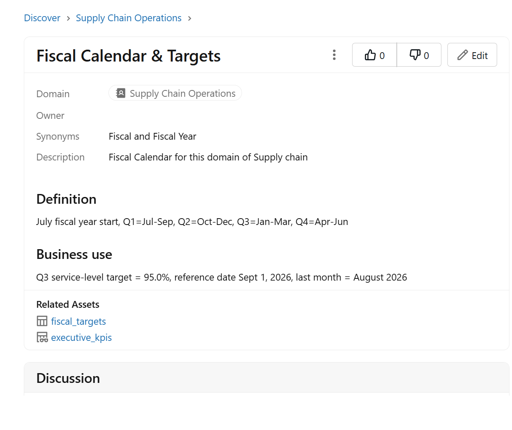
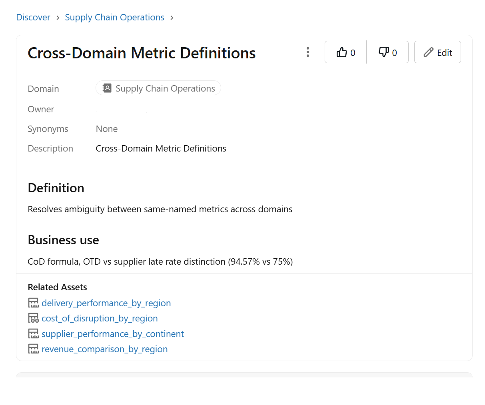

# Supply Chain Control Tower — Multi-Agent Genie Workshop

## What This Demo Proves

Enterprise data warehouses and data marts contain the answers to complex business questions — but AI agents often **hallucinate**, **misinterpret column names**, or **generate incorrect SQL** when querying that data. This demo shows how to build AI-powered data analysis agents on Databricks that are **grounded to business truth** and **consistently generate correct queries** across a multi-domain supply chain data warehouse — without hallucination.

Using a realistic supply chain scenario with 23 tables across 5 business domains, this workshop:

- Builds a **Supervisor Agent** that orchestrates 5 domain-specific **Genie Agents** to answer complex cross-domain business questions
- Starts at **low accuracy** with a minimal baseline and progressively improves to **100% accuracy** across 3 iterations
- Demonstrates **why each improvement matters**: column comments + certified queries, UC metric views + governed tags + Open Knowledge views, and UC Pages + Domains
- Shows that the last mile of accuracy requires **data governance** (formal business definitions, Unity Catalog tags, metric views) — not just better prompts

### What Are Genie Agents and Supervisor Agents?

**[Genie Agents](https://docs.databricks.com/en/genie/index.html)** (formerly called Genie Spaces) are AI-powered data analysis agents in Databricks. You give them access to specific tables, and they translate natural-language questions into SQL, execute the query, and return results. They can be enhanced with certified queries, column synonyms, and instructions to improve accuracy.

**[Supervisor Agents](https://docs.databricks.com/en/generative-ai/agent-framework/build-supervisor-agent.html)** orchestrate multiple sub-agents (including Genie Agents) as tools. The Supervisor receives a complex question, decides which sub-agents to call and in what order, synthesizes their results, and produces a unified answer. This enables cross-domain analysis that no single agent could perform alone.

##### Ground Truth: Demo Proxy for Real-World Feedback

> In this demo, we use a **benchmark ground-truth framework** — **40 metrics** across 8 groups — to objectively measure whether the agents are generating the right SQL and returning the right numbers. Each metric is tested individually by sending a targeted question to the relevant domain agent and comparing the response against a known ground-truth value at exact 2-decimal precision.
>
> | Group | Count | What It Tests |
> | --- | --- | --- |
> | A: Logistics MV | 6 | OTD rate, late rate, avg delay, shipment counts, wasted freight |
> | B: Demand MV | 4 | Revenue (Aug vs Jul), dollar change, % change |
> | C: Inventory MV | 5 | Below safety stock, stockouts, days of supply |
> | D: Supplier MV | 7 | PO counts, late %, lead time variance (overall + by continent) |
> | E: Cross-domain | 3 | Fill rate, SLA penalties, Cost of Disruption |
> | F: Indirect / Ambiguity | 6 | Region synonyms, per-order vs per-vendor, status filters |
> | H: Hard failures | 7 | Wrong table, cross-domain joins, derived ratios |
> | G: Q3 Fiscal (UC Pages) | 2 | Q3 service-level target (only in UC Pages, not in any table) |
>
> After each improvement iteration, we rerun the failing tests and track progressive accuracy: Baseline (65%) → Iteration 1 (85%) → Iteration 2 (95%) → Iteration 3 (100%). A separate **comprehensive prompt benchmark** sends one broad executive question to the Supervisor Agent and scores how many of the 40 values appear in its unified report — testing whether UC improvements for individual metrics *indirectly* improve the Supervisor's coverage.

> **In production, there is no ground truth table.** Instead, accuracy improves through an iterative **user feedback loop**:

1. A business user asks a question via a Genie Agent or Supervisor Agent
2. The agent generates SQL and returns a result
3. The user reviews the result and provides feedback: 👍 (correct) or 👎 (wrong)
4. A data team member reviews the feedback, identifies the root cause (wrong column, wrong filter, ambiguous metric), and applies a fix — exactly the same kinds of fixes shown in this demo (certified queries, synonyms, instructions, metric views)
5. Over time, the agent gets better and better at answering questions correctly

> **This demo compresses months of user-feedback-driven improvement into 3 scripted iterations**, so you can see the full journey in a single workshop session. Every fix we apply (comments, synonyms, certified queries, metric views, UC Pages) is the same fix a data team would apply in response to real user feedback.

---

## The Business Scenario

A **multi-regional retail company** sells 100 SKUs across 5 product families (Apparel, Accessories, Footwear, Home Goods, Electronics) through 4 US regions (Western, Eastern, Central, Southern). Products are sourced from 12 international suppliers across Asia, Europe, and North America, stored in 12 warehouses, and shipped via 8 carriers through 7 distribution centers.

The company's data warehouse is organized in [Unity Catalog](https://docs.databricks.com/en/data-governance/unity-catalog/index.html) with 5 domain schemas — each owned by a different business team — plus a shared `reporting` schema for cross-domain executive views.

### Data Model (Final State)

The demo starts with **19 base tables + 4 reporting views**, then layers on **4 UC Metric Views**, **1 cross-domain governed executive view**, and the benchmark table used for evaluation. The diagram below shows the final semantic surface area exposed to Genie.

```mermaid
flowchart TD
    C["GAP_Demo_Dev catalog"]

    C --> D["demand_analysis schema"]
    C --> I["inventory_management schema"]
    C --> L["logistics_operations schema"]
    C --> S["supplier_procurement schema"]
    C --> R["reporting schema"]

    D --> D1["Base tables: products, customer_segments, sales_orders, demand_forecasts, pos_data, promotions"]
    D --> D2["UC Metric View: revenue_comparison_by_region"]

    I --> I1["Base tables: warehouse_data, inventory_ledger, store_inventory, stock_movements"]
    I --> I2["UC Metric View: inventory_safety_stock_metrics"]

    L --> L1["Base tables: carriers, distribution_centers, shipments, transit_data"]
    L --> L2["UC Metric View: delivery_performance_by_region"]

    S --> S1["Base tables: suppliers, supplier_orders, supplier_lead_times, vendor_slas, procurement_data"]
    S --> S2["UC Metric View: supplier_performance_by_continent"]

    R --> R1["Reporting views: executive_kpis, regional_performance_summary, revenue_trend, supply_chain_risk_scorecard"]
    R --> R2["Governed executive view: cost_of_disruption_by_region"]
    R --> R3["Benchmark table: ground_truth_kpis"]

    style D2 fill:#e8f4fd,stroke:#1f77b4
    style I2 fill:#e8f4fd,stroke:#1f77b4
    style L2 fill:#e8f4fd,stroke:#1f77b4
    style S2 fill:#e8f4fd,stroke:#1f77b4
    style R2 fill:#fff4e5,stroke:#f39c12
    style R3 fill:#f4e9ff,stroke:#7e57c2
```



**Why this diagram matters**: Genie gets SQL right only when each layer exposes a clear grain and a governed semantic object. Base tables answer raw questions. UC Metric Views answer certified KPI questions. UC Pages answer policy and definition questions that are intentionally not in SQL tables at all.

| Schema | Key Tables (bold = primary fact table) | Rows | Business Domain |
|--------|---------------------------------------|------|----------------|
| `demand_analysis` | products, customer_segments, **sales_orders**, demand_forecasts, pos_data, promotions | ~74K | Revenue, orders, demand forecasting |
| `inventory_management` | warehouse_data, **inventory_ledger**, store_inventory, stock_movements | ~15K | Stock levels, stockouts, safety stock |
| `logistics_operations` | carriers, distribution_centers, **shipments**, transit_data | ~38K | Delivery performance, delay tracking |
| `supplier_procurement` | suppliers, **supplier_orders**, supplier_lead_times, vendor_slas, procurement_data | ~1.7K | Supplier reliability, SLA penalties |
| `reporting` | executive_kpis, regional_performance_summary, revenue_trend, supply_chain_risk_scorecard, cost_of_disruption_by_region, ground_truth_kpis | Views | Cross-domain executive dashboards |

All data is generated with a **fixed reference date** of September 1, 2026 (`base_date = datetime(2026, 9, 1)`). "Last month" = August 2026, "Prior month" = July 2026. The demo produces identical results every run.

---

## The Single Canonical Prompt

A single comprehensive prompt covers all 10 primary ground truth metrics **and** every measure in every metric view across all 5 domains — including Cost of Disruption and Q3 targets:

> **"We need a complete supply chain health check for our West region in August 2026. The CFO wants to understand what drove the revenue decline versus July — show the actual August and July revenue numbers, the dollar change, and the percentage change — and which product families are most at fault. Are our on-time delivery rate and average delay for West region shipments contributing to the problem? How many total shipments went out and how many were late? I also need our current fill rate, how many inventory positions are sitting below safety stock in the West region, how many unique SKUs are affected, what is our days of supply for those at-risk items, and how many SKUs are completely stocked out. On the vendor side: what percentage of vendors delivered late in August, how many purchase orders were late out of total, what is the average lead time variance, and what are the total vendor SLA penalties we have incurred? Bring it all together as our total Cost of Disruption by region for August 2026 — cancelled revenue, at-risk backorder revenue, wasted freight on late shipments, and supplier penalty exposure in one number per region. Are we going to miss our Q3 service-level targets, and what are the top actions we should take?"**

This prompt is **deliberately designed** so that every measure in every UC Metric View is an expected metric the agent should return. It uses **business vocabulary** that does NOT match the database column names — "revenue" (not `total_amount`), "fill rate" (not `service_level_pct`), "vendor" (not `supplier`), "Cost of Disruption" (not in any table). Each iteration adds one UC Semantics feature to close the gap between business language and database reality.

**Prompt-to-measure coverage** (every metric view measure is explicitly asked):

| Prompt phrase | Metric view measure it expects | View |
| --- | --- | --- |
| "actual August and July revenue numbers" | `revenue_last_month`, `revenue_prior_month` | `revenue_comparison_by_region` |
| "the dollar change" | `revenue_change_dollars` | `revenue_comparison_by_region` |
| "the percentage change" | `revenue_change_pct` | `revenue_comparison_by_region` |
| "on-time delivery rate" | `on_time_delivery_rate` | `delivery_performance_by_region` |
| "average delay" | `avg_delay_days` | `delivery_performance_by_region` |
| "how many total shipments went out" | `total_shipments` | `delivery_performance_by_region` |
| "how many were late" | `late_shipments` | `delivery_performance_by_region` |
| "wasted freight on late shipments" | `wasted_freight_cost` | `delivery_performance_by_region` |
| "inventory positions below safety stock" | `positions_below_safety_stock` | `inventory_safety_stock_metrics` |
| "how many unique SKUs are affected" | `unique_skus_below_safety` | `inventory_safety_stock_metrics` |
| "days of supply for those at-risk items" | `avg_days_of_supply` | `inventory_safety_stock_metrics` |
| "SKUs are completely stocked out" | `unique_skus_in_stockout` | `inventory_safety_stock_metrics` |
| "percentage of vendors delivered late" | `supplier_late_rate_pct` | `supplier_performance_by_continent` |
| "purchase orders were late out of total" | `total_purchase_orders`, `late_purchase_orders` | `supplier_performance_by_continent` |
| "average lead time variance" | `avg_lead_time_variance` | `supplier_performance_by_continent` |
| "Cost of Disruption" (components) | `total_cost_of_disruption` + components | `cost_of_disruption_by_region` |
| "Q3 service-level targets" | 95.0% from UC Page | UC Page (not a metric view) |

If the Supervisor or any domain agent **cannot find** a metric the prompt asks for, it must explicitly state that the metric was NOT_FOUND or NOT_UNDERSTOOD in its response. This makes the ground-truth scorer’s job unambiguous: a missing number is always a miss, never a silent gap.

## The Genie Ontology and UC Semantics Stack

> **Source**: [Databricks UC Semantics documentation](https://docs.databricks.com/en/uc-semantics/index.html)

### Image 1: UC Semantics Architecture



The diagram above shows how the **Genie Ontology** sits between AI consumers (Genie, MCP/SQL/API, Dashboards) and the underlying data sources (Delta Lake, Iceberg, federated sources, business apps, workspace assets). The Ontology is a **continuously-learned enterprise context** layer — it gets smarter every time a user interacts with data.

Under the Ontology, **Unity Catalog Semantics** provides the **user-defined** semantic objects that feed the Ontology:

* **Domains**: Business-aligned organization of data assets. In this demo: a single "Supply Chain Operations" domain that groups all 5 schemas. Domains help Genie route questions to the right schema and help humans discover related assets on the Discover page.
* **Glossary** (UC Pages): Governed business concept definitions — policies, formulas, terminology — that Genie references authoritatively. In this demo: "Fiscal Calendar & Targets" (Q3=Jan-Mar, target=95%) and "Cross-Domain Metric Definitions" (CoD formula, OTD vs supplier late rate). Pages answer questions that are intentionally NOT in any SQL table.
* **Metrics** (Metric Views): Reusable KPI definitions with `MEASURE()` syntax. In this demo: `delivery_performance_by_region`, `revenue_comparison_by_region`, `inventory_safety_stock_metrics`, `supplier_performance_by_continent`. Metric Views eliminate formula ambiguity by encoding the exact business definition in the column name itself.

The key insight: data alone is not enough. The UC Semantics layer teaches Genie **what the data means**, not just what it contains.

### Image 2: The Six Foundation Layers



This diagram shows the six layers that make the Genie Ontology progressively more accurate. Each layer builds on the previous one. The feedback arrow on the right shows that evaluation at Layer 5 drives improvements back into every earlier layer.

| Layer | What It Does | This Demo’s Implementation |
| --- | --- | --- |
| **0. Get the data model right** | Model gold for agents (star schemas, clear grain). Resolve entities into golden records. | 23 base tables across 5 domain schemas with clear fact tables (`sales_orders`, `shipments`, `inventory_ledger`, `supplier_orders`) and dimension tables. Fixed monthly grain. |
| **1. Enrich metadata** | Table and column descriptions. Governed tags and classification. `dbxmetagen` for scale. | **Iter 1**: 180+ column/table comments via `ALTER TABLE SET COMMENT`. **Iter 2**: governed tags (`domain`, `certification_status`). `dbxmetagen` mentioned as scale path but excluded from workshop. |
| **2. Model business semantics** | Metric Views for certified KPIs. Declared relationships (PK/FK). Domains. Pages. | **Iter 2**: 4 UC Metric Views + cross-domain Open Knowledge view. **Iter 3** (manual): UC Domain + UC Pages. PK/FK relationships documented for future implementation. |
| **3. Curate context-rich assets** | Certify trusted assets. Classify and quality-check. Instructions, definitions, examples. | **Iter 1**: Certified SQL examples in agent instructions + column/table comments. **Iter 2**: Governed tags on all metric views and schemas. |
| **4. Govern access** | UC access controls. Row-level security and column masking. ABAC. Unity AI Gateway. | Standard catalog/schema grants. Row-level security, column masking, and ABAC documented as extension opportunities. |
| **5. Evaluate & improve** | Benchmark answers. Observe and trace. Capture feedback. Watch for drift. | `ground_truth_kpis` benchmark table (10 primary + 14 indirect metrics). Python scorer + Evaluator Genie Agent. Verification after every iteration shows progressive improvement. |

The practical rule: **build one domain at a time, one layer at a time.** This workshop compresses the full journey into 3 scripted iterations so you can see the progression in a single session.

> **Note on images**: The two reference images above are from [Databricks UC Semantics documentation](https://docs.databricks.com/en/uc-semantics/index.html).

### UC Semantic Features Actually Used in This Demo

The table below lists every UC semantic layer feature this demo uses to fix Genie agent accuracy, grouped by iteration. This is the complete set — no other mechanisms (prompt hacks, fine-tuning, custom models) are involved. Every fix is a standard Unity Catalog or Genie API capability.

#### Iteration 1 — Metadata Enrichment (Baseline 65% → 85%)

| # | Feature | API / SQL | What It Does in This Demo | Tests Fixed |
| --- | --- | --- | --- | --- |
| 1 | **Column Comments** | `ALTER TABLE ... ALTER COLUMN ... COMMENT '...'` | Disambiguation text on individual columns. Tells agent which table to use for lead time variance, defines exact order status values, clarifies vendor late % is per-order. | D04, D06, H01, H02, F03, H03 |
| 2 | **Table Comments** | `ALTER TABLE ... SET TBLPROPERTIES ('comment' = '...')` | Table-level warnings. Marks `supplier_lead_times` as a pre-aggregated summary that should NOT be used for variance calculations. | D04, D06, H01, H02 |
| 3 | **Example SQL Queries** | `example_question_sqls` in Genie `serialized_space.instructions` (REST API PATCH) | Certified SQL patterns that appear in the Genie Agent **Examples tab**. Teaches the agent the exact SQL shape for lead time variance, vendor late %, fulfilled order count, and product family decline. 6 examples across supplier + demand agents. | A04, D04, D06, F02, F03, H01, H02, H03 |
| 4 | **Benchmark Questions** | `benchmarks.questions` in Genie `serialized_space` (REST API PATCH) | Ground-truth Q&A pairs that appear in the Genie Agent **Benchmarks tab**. Used for evaluation — each benchmark has a SQL answer that Genie compares result sets against during benchmark runs. 7 benchmarks across supplier + demand + logistics agents. | (evaluation, not direct fix) |

#### Iteration 2 — Business Semantics (85% → 95%)

| # | Feature | API / SQL | What It Does in This Demo | Tests Fixed |
| --- | --- | --- | --- | --- |
| 5 | **UC Metric Views** | `CREATE VIEW ... WITH METRICS LANGUAGE YAML` | Declarative dimension + measure definitions. 4 Metric Views define the exact business formula for every KPI the agent needs: `delivery_performance_by_region` (6 measures), `revenue_comparison_by_region` (4 measures), `inventory_safety_stock_metrics` (5 measures), `supplier_performance_by_continent` (4 measures). Agent queries the view directly instead of inferring SQL. | Stabilizes A01-A06, B01-B04, C01-C05, D01-D07 |
| 6 | **Open Knowledge View** | `CREATE VIEW ... AS` (cross-domain governed join) | A governed view that joins data from 4 domain schemas no single agent can see. `cost_of_disruption_by_region` combines cancelled revenue (demand), wasted freight (logistics), SLA penalties (supplier), and stockout counts (inventory) into one queryable table. | E03, H05, H06, H07 |
| 7 | **UC Governed Tags** | `ALTER TABLE SET TAGS ('key' = 'value')` | Classification tags on all metric views and the CoD view: `domain`, `metric_type`, `data_quality`, `time_granularity`. Helps Genie prefer the certified, authoritative asset over a plausible but wrong table. | (ranking / preference) |
| 8 | **Schema Domain Tags** | `ALTER SCHEMA SET TAGS ('domain' = '...', 'business_unit' = '...')` | Schema-level business domain classification. All 5 domain schemas tagged with their business function. Routes questions to the right schema and signals organizational ownership. | (routing) |

#### Iteration 3 — Governance Layer (95% → 100%)

| # | Feature | API / SQL | What It Does in This Demo | Tests Fixed |
| --- | --- | --- | --- | --- |
| 9 | **UC Domain** | Created on the **Discover page** (UI) | Business-aligned organization of data assets. A single "Supply Chain Operations" domain groups all 5 schemas. Domains help Genie route questions to the right schema and help humans discover related assets. Persists through teardown — it IS the governance layer. | (routing + discovery) |
| 10 | **UC Pages (Glossary)** | Created on the **Discover page** (UI), attached to the Domain | Governed business concept definitions — policies, formulas, terminology — that Genie references authoritatively. **Page 1**: Fiscal Calendar & Targets (FY starts July, Q3=Jan-Mar not Jul-Sep, current FY=FY2027, Q3 service-level target=95%). **Page 2**: Cross-Domain Metric Definitions (vendor late rate = per-ORDER 75%, never per-vendor 83.33%; CoD formula; fulfillment = Fulfilled only). These answer questions that are **intentionally NOT in any SQL table**. | G01, G02, F02 |
| 11 | **Reference Table** | `CREATE TABLE ... fiscal_targets` + added to Executive agent data sources | Queryable data backing the UC Pages. Contains fiscal quarter definitions and target values so the agent can run SQL against policy data. | G01, G02 |

#### Supporting Features (used throughout)

| # | Feature | API / SQL | What It Does in This Demo |
| --- | --- | --- | --- |
| 12 | **Genie Agent Instructions** | `text_instructions` in `serialized_space` (REST API PATCH) | Natural language guidance for each agent: table descriptions, key columns, disambiguation rules, date references, out-of-scope handling. All 5 agents have multi-paragraph instructions. In Iteration 3, agent instructions are **commented out** to test whether UC Pages alone suffice. |
| 13 | **Genie Agent Data Sources** | `data_sources.tables` in `serialized_space` (REST API PATCH) | Explicit table access lists per agent. Tables sorted alphabetically (API requirement). Views and reference tables added incrementally in each iteration. Controls what each agent can see and query. |

> **Key insight**: Features 1-8 are the **repeatable, scriptable** part of the semantic layer — they can be applied via SQL and API in CI/CD. Features 9-10 are the **governance** part — they require human judgment about business definitions and organizational structure, and they are created in the Discover page UI. Feature 11 bridges the two: a scriptable table that encodes governance decisions. This split mirrors how real teams work: data engineers script the metadata enrichment; data stewards define the business glossary.

---

## How Genie Gets the SQL Right

Genie does **not** become accurate because of one magic prompt. It becomes accurate because each semantic layer removes one specific failure mode in SQL generation.

| What Genie needs to do | What fixes it | Why it matters |
| --- | --- | --- |
| Map business words to physical columns | **Synonyms** + comments | "revenue" must resolve to `total_amount`; "vendor" must resolve to supplier assets |
| Pick the right table and grain | **Comments** + governed tags + domains | Helps Genie choose shipments vs sales vs supplier orders, and avoid row-grain mistakes |
| Write the right formula | **Metric Views** + certified SQL examples | Derived KPIs like MoM revenue change, OTD, and CoD should not be recomputed ad hoc |
| Join along the right business path | **Declared relationships** + trusted views | Prevents bad joins across domains and helps route to the correct asset |
| Distinguish policy from data | **UC Pages** | Q3 targets are business policy, not table data |
| Prefer the trusted asset | **Certification** + examples + instructions | Steers ranking toward the vetted source instead of a plausible but wrong table |
| Keep improving over time | **Benchmark scoring, traces, feedback** | Catches regressions when the model or ontology changes |

For this demo specifically:

* **Synonyms** fix vocabulary mapping.
* **Comments** fix ambiguous columns and row grain.
* **Metric Views** fix derived KPI SQL.
* **UC Pages** fix non-SQL business facts.
* **Certified queries, examples, and supervisor instructions** fix routing and exact SQL shape.
* **Certification, governed tags, and domains** make Genie prefer the right governed asset.
* **The scorer and evaluator** prove whether the SQL grounding actually improved.

## Architecture

```
Supervisor Agent ("Supply Chain Control Tower")
    ├─ Demand Analysis Agent        → Genie Agent (6 tables + 1 metric view)
    ├─ Inventory Management Agent   → Genie Agent (4 tables + 1 metric view)
    ├─ Logistics Operations Agent   → Genie Agent (4 tables + 1 metric view)
    ├─ Supplier Risk Agent          → Genie Agent (5 tables + 1 metric view)
    └─ Executive Reporting Agent    → Genie Agent (4 views + 1 metric view)

Evaluator Agent (external, NOT a supervisor tool)
    └─ Genie Agent (1 table: ground_truth_kpis) — called by Python scorer only
```

### How the Supervisor Orchestrates a Query

When a user asks a business question, the Supervisor Agent breaks it down, routes sub-questions to domain-specific Genie Agents, collects their SQL-grounded answers, and synthesizes a unified executive brief.

**Nothing is hardcoded.** The Supervisor is an LLM with tool-calling capability. Each Genie Agent is registered as a "tool" on the Supervisor endpoint. The LLM autonomously decides:

1. **Which agents to call** — it reads the tool descriptions and picks the relevant domain agents
2. **What to ask each agent** — it generates the sub-query text dynamically (the exact wording varies run to run)
3. **How to synthesize** — it combines the responses into a unified report

This means there are **two layers of LLM non-determinism**: the Supervisor's phrasing of the sub-query, and the Genie Agent's SQL generation from that sub-query. For example, the Supervisor might ask the logistics agent "Show late delivery rate for Western region" in one run and "What is the percentage of late shipments to Western in August 2026?" in the next — both valid, but the Genie Agent may generate different SQL for each.

The only things we control are:

* **Supervisor instructions** — the system prompt (~2200 chars) defining output format and behavior
* **Tool descriptions** — short descriptions of each Genie Agent that help the Supervisor decide which one to call
* **UC semantic features** — comments, metric views, example SQL, UC Pages that help the Genie Agent write correct SQL regardless of how the sub-query is phrased

This is exactly why the semantic layer matters: **we cannot control what the Supervisor asks, but we CAN ensure that however the Genie Agent interprets it, the governed asset steers it to the correct SQL path.**

The sequence diagram below shows one representative orchestration flow (actual sub-queries vary per run):



## The Demo Story

A cascading supply chain failure:

1. **Asian suppliers** are 100% late (30/30 POs, +13.7 day average lead-time variance)
2. **Western inventory** collapses (33 stockouts, 109 SKU-warehouse positions below safety stock)
3. **Western logistics** breaks down (94.6% late delivery rate, 1,027 of 1,086 shipments late)
4. **Western revenue** drops ~$1.24M (-27.1%) as customers get backordered, partially fulfilled, or cancelled orders
5. **Company service level** falls to 70.4% — quarterly 95% target at CRITICAL RISK

The Supervisor Agent investigates all 5 domains and produces a structured executive brief with root cause analysis, cross-domain reconciliation, and a prioritized action plan.

---

## Baseline Test Results (40-Test Assumption Tester v3)

Before any UC Semantics features are applied, the 5 Genie Agents are tested with **40 individual questions** using **exact 2-decimal precision matching** (`round(abs(found), 2) == round(abs(expected), 2)`). No tolerance bands — either it matches or it doesn't.

**Baseline score: 26/40 PASS (65%), 14 FAIL (35%)**

> "PASS" means the agent answers correctly at baseline WITHOUT any UC feature.
> "FAIL" means the agent genuinely needs the UC feature to answer correctly.

| Group | Tests | Pass | Fail | Coverage |
| --- | --- | --- | --- | --- |
| A: Logistics MV | 6 | 5 | 1 | A04 fails: date ambiguity ("August" without year) |
| B: Demand MV | 4 | 4 | 0 | 100% at baseline |
| C: Inventory MV | 5 | 5 | 0 | 100% at baseline |
| D: Supplier MV | 7 | 5 | 2 | Wrong table (supplier_lead_times vs supplier_orders) |
| E: Cross-domain | 3 | 2 | 1 | CoD requires cross-domain Open Knowledge view |
| F: Indirect/Ambiguity | 6 | 4 | 2 | Per-vendor vs per-order ambiguity, status filter |
| H: Hard failures | 7 | 1 | 6 | Cross-domain queries impossible for single agent |
| G: Q3/UC Pages | 2 | 0 | 2 | Target not in any table |

### The 12 Failures and Their Fix Plan (3 Iterations)

| ID | Metric | GT | Failure Pattern | Fix Iteration |
| --- | --- | --- | --- | --- |
| D04 | Avg lead time variance (overall) | 8.69 | Wrong table: agent queries supplier_lead_times instead of supplier_orders | **Iter 1** |
| D06 | Avg lead time variance (Asia) | 13.67 | Same wrong-table issue | **Iter 1** |
| F02 | Vendor late % (per-order) | 75.00 | Per-vendor (83.33%) vs per-order (75%) ambiguity | **Iter 1** |
| F03 | Fulfilled order count | 1342 | Includes Partially_Fulfilled (1512) | **Iter 1** |
| F05 | Backordered order count | 275 | Intermittent status filter issue | **Iter 1** |
| H03 | Order fulfillment rate | 71.23 | Includes Partially_Fulfilled (80.25%) | **Iter 1** |
| E03 | Cost of Disruption (Western) | 3757298.31 | Cross-domain: no single agent has demand + logistics + supplier data | **Iter 2** |
| H05 | Revenue at risk from disruptions | 3138569.66 | Cross-domain: demand + logistics | **Iter 2** |
| H06 | Revenue at risk per stockout SKU | 14368.63 | Cross-domain: inventory + demand | **Iter 2** |
| H07 | Disruption cost / revenue ratio | 1.12 | Cross-domain: CoD / revenue | **Iter 2** |
| G01 | Q3 service-level target (miss?) | 95.0 | Target not in any table; Q3 = fiscal Jan-Mar | **Iter 3** |
| G02 | Q3 service-level target value | 95.0 | Target not in any table | **Iter 3** |

### Iteration Plan

| Iteration | UC Feature Class | What It Does | Targets | Expected Outcome |
| --- | --- | --- | --- | --- |
| **1. Column Comments + Certified Queries** | Enterprise Context (Layer 1) | Table/column comments for disambiguation + certified SQL examples for ambiguous metrics | A04, D04, D06, F03, H01, H02, H03 | 33/40 → fixes wrong-table, status ambiguity, and date inference |
| **2. UC Metric Views + Governed Tags + Open Knowledge** | Business Semantics (Layer 2) | 4 domain metric views (YAML), schema domain tags, 1 cross-domain Open Knowledge view (CoD) | E03, H05, H06, H07 | 37/40 → fixes cross-domain queries |
| **3. UC Pages + Domain + Temporal Context** | Glossary & Governance (Layer 2+3) | Fiscal calendar reference table, temporal context on all agents, UC Domain + Pages (created in UI) | F02, G01, G02 | 40/40 → fixes missing business definitions + remaining ambiguity |

### Key Insight

Genie Agents are remarkably capable at baseline — they correctly map business terms to column names ("revenue" → `total_amount`, "fill rate" → `service_level_pct`) and handle region inference ("West" → `ILIKE '%Western%'`) without any synonyms, comments, or instructions. The 65% baseline accuracy proves that the UC Semantics stack is needed only for genuinely hard cases: table disambiguation, definition ambiguity, cross-domain computation, and business policy.

---

## Quick Start

### Option A: One-Click Pipeline (recommended)

Run the master orchestrator notebook. It handles everything: teardown, data generation, agent creation, all iterations, and verification.

| Notebook | Description |
|----------|-------------|
| `src/notebooks/00_run_all.py` | Runs teardown → create → generate → setup → all iterations → verify. Discovers the supervisor endpoint dynamically. |

Widgets:
- `catalog_name` (default: `GAP_Demo_Dev`)
- `warehouse_id` — set this to your SQL Warehouse ID
- `run_mode`: `full` (teardown + rebuild), `skip_teardown`, or `iterations_only`

The notebook runs `verify_ground_truth()` after each stage so you can see the accuracy progression live.

### Option B: Step-by-Step (for workshop presentation)

#### Prerequisites

- Databricks workspace with [Unity Catalog](https://docs.databricks.com/en/data-governance/unity-catalog/index.html) enabled
- A running [SQL Warehouse](https://docs.databricks.com/en/compute/sql-warehouse/index.html) (note the warehouse ID from the SQL Warehouses page)
- Permission to create catalogs, schemas, and tables
- Each script takes a `catalog_name` widget (default: `GAP_Demo_Dev`)
- `08_setup_genie_supervisor.py` also takes a `warehouse_id` widget

#### Step 1: Build the Data Layer (run once)

Open each notebook in the Databricks UI and **Run All**, in order:

| # | Script | What It Does | Time |
|---|--------|-------------|------|
| 1 | `src/01_create_catalog_schemas.py` | Creates catalog + 5 schemas | ~10s |
| 2 | `src/02_generate_demand_data.py` | 6 tables: products, customers, sales_orders, forecasts, POS, promotions | ~30s |
| 3 | `src/03_generate_inventory_data.py` | 4 tables: warehouses, inventory_ledger, store_inventory, stock_movements | ~20s |
| 4 | `src/04_generate_logistics_data.py` | 4 tables: carriers, distribution_centers, shipments, transit_data | ~20s |
| 5 | `src/05_generate_supplier_data.py` | 5 tables: suppliers, supplier_orders, lead_times, SLAs, procurement | ~20s |
| 6 | `src/06_create_reporting_views.py` | 4 views: executive_kpis, regional_performance, revenue_trend, risk_scorecard | ~10s |
| 7 | `src/07_add_all_comments.py` | Adds table + column comments (180+ columns) for Genie accuracy | ~30s |

**Result**: 19 tables + 4 views across 5 schemas in `GAP_Demo_Dev`.

#### Step 2: Create the Baseline Agents

| # | Script | What It Does |
|---|--------|-------------|
| 8 | `src/08_setup_genie_supervisor.py` | Creates 5 domain Genie Agents + Evaluator (external scorer) + ground truth table + Supervisor Agent with 5 domain tools |

Set the `warehouse_id` widget to your SQL Warehouse ID before running.

This creates a **deliberately minimal** baseline:
- Genie Agents have tables but **no** certified queries, synonyms, or enhanced instructions
- Supervisor has basic instructions — no structured format, no specific question phrasings
- Expected accuracy: **~65%** (26 of 40 metric tests pass at baseline)

**Test it now** — go to the Agents playground and send the canonical prompt. The Supervisor will try but produce inconsistent, partially incorrect results.

#### Step 3: Progressive Improvement (the core demo)

All 3 improvement iterations run **inline** in `src/notebooks/00_run_all.py` (cells 7-9). Run the full notebook end-to-end — do NOT run iteration cells in isolation (they depend on the baseline agents created in earlier cells).

After each iteration cell, the notebook automatically runs `test_failing_metrics()` to show progress.

##### Iteration 1: Column Comments + Example SQL Queries + Benchmarks (cell 7)

**UC Features**: `ALTER TABLE SET COMMENT`, Example SQL Queries (`example_question_sqls` API → Genie Examples tab), Benchmarks (`benchmarks.questions` API → Genie Benchmarks tab)

**What it fixes**: Table/column comments resolve table disambiguation (agent picks `supplier_orders` instead of `supplier_lead_times` for lead time variance). Example SQL Queries teach Genie correct SQL patterns for common questions via the structured Examples tab (stronger than embedding SQL in text instructions). Benchmark questions provide ground-truth Q&A pairs for evaluating accuracy via the Benchmarks tab. Fixes status-filter ambiguity ("Fulfilled" excludes "Partially_Fulfilled") and per-order vs per-vendor aggregation.

**Targets**: A04, D04, D06, F03, H01, H02, H03 → **33/40 (82%)**

##### Iteration 2: UC Metric Views + Governed Tags + Open Knowledge View (cell 8)

**UC Features**: `CREATE VIEW WITH METRICS LANGUAGE YAML`, `ALTER TABLE SET TAGS`, `ALTER SCHEMA SET TAGS`

**What it fixes**: 4 UC Metric Views (`delivery_performance_by_region`, `revenue_comparison_by_region`, `inventory_safety_stock_metrics`, `supplier_performance_by_continent`) encode exact KPI formulas in governed column names. 1 Open Knowledge View (`cost_of_disruption_by_region`) bridges data from 4 domain schemas that no single agent can access alone. Governed tags and schema domain tags improve asset discovery.

**Targets**: E03, H05, H06, H07 → **37/40 (92%)**

**Key insight**: Open Knowledge is a governed view that crosses domain boundaries — it exists because some business questions (like Cost of Disruption) require data from multiple schemas.

##### Iteration 3: UC Domain + UC Pages — Governance Layer (cell 9)

**UC Features**: UC Domain (Discover page), UC Pages (glossary / business definitions), Reference Table (`fiscal_targets`)

**What it fixes**: UC Pages feed directly into Genie's ontology. **Page 1** ("Fiscal Calendar & Targets") defines Q3=Jan-Mar (not calendar Jul-Sep), the 95% service-level target, and temporal context (reference date Sept 1 2026, last month = August 2026). **Page 2** ("Cross-Domain Metric Definitions") governs that "vendor late rate" = late POs / total POs per ORDER (75.0%), never COUNT(DISTINCT supplier_id) per-vendor (83.33%). The `fiscal_targets` reference table provides the queryable data backing Page 1. No agent instruction injection — the governance layer IS the fix.

**Targets**: F02, G01, G02 → **40/40 (100%)**

**Key insight**: The last mile of accuracy requires business governance, not prompt engineering. UC Pages resolve ambiguity at the ontology level — when Genie encounters "Q3 target" or "% vendors delivered late", it consults the governed Page definitions before writing SQL. This is what separates a semantic layer from mere metadata enrichment.

##### Prerequisite: UC Domain and Pages (manual — from UI)

Before running Iteration 3, create these on the **Discover** page:

* **Domain**: "Supply Chain Operations" — assign all 5 schemas
* **Page 1**: "Fiscal Calendar & Targets" — Synonyms: Fiscal, Fiscal Year. Definition: July FY start, Q1=Jul-Sep, Q2=Oct-Dec, **Q3=Jan-Mar** (NOT calendar Jul-Sep), Q4=Apr-Jun. Business Use: Q3 service-level target = 95.0%. Reference date: Sept 1, 2026. Last month = August 2026, prior month = July 2026.

  

* **Page 2**: "Cross-Domain Metric Definitions" — Definition: Vendor Late Rate = late POs / total POs per ORDER (75.0%), NEVER per distinct vendor (83.33%). OTD rate (94.57%) ≠ supplier late rate (75%). CoD formula. Fulfillment rate = only `Fulfilled` status, not `Partially_Fulfilled`.

  

#### Step 4: Teardown (when done)

| # | Script | What It Does |
|---|--------|-------------|
| 9 | `src/09_teardown.py` | Deletes all Genie Agents, Supervisor Agent, and drops the entire catalog. UC Domain + Pages persist by design (governance layer). |

---

## Progressive Improvement Summary

| Stage | What Changed | UC Feature | Score |
|-------|-------------|-----------|-------|
| **Baseline** | Bare tables + basic agent instructions, no semantic enrichment | None | **26/40 (65%)** |
| **+ Iter 1: Comments + Certified Queries** | Column/table comments for disambiguation + certified SQL examples | `ALTER TABLE SET COMMENT` + instruction text | **33/40 (82%)** |
| **+ Iter 2: Metric Views + Tags + Open Knowledge** | 4 UC Metric Views (YAML) + governed tags + CoD cross-domain view | `CREATE VIEW WITH METRICS LANGUAGE YAML` + `ALTER TABLE SET TAGS` | **37/40 (92%)** |
| **+ Iter 3: UC Pages + Domain + Temporal** | Fiscal targets reference table + temporal context + UC Domain & Pages (UI) | UC Pages + Domains + reference tables | **40/40 (100%)** |

## Expected Output (after all 3 iterations)

The Supervisor produces a structured 7-section executive brief:

1. **What I Understood** — restates the business question
2. **Investigation Plan** — lists which agents to query and exact questions
3. **Findings by Agent** — for each of 5 agents: questions asked, SQL used, result summary, confidence
4. **Cross-Domain Reconciliation** — table comparing metrics across agents and governed sources
5. **Root Cause Chain** — numbered causal cascade: Supplier → Inventory → Logistics → Revenue → Service Level
6. **Ground Truth Scorecard** — primary and indirect tracked metrics scored separately (EXACT / CLOSE / MISS / NOT_FOUND)
7. **Conclusion and Actions** — direct answer + action tables + KPIs to monitor + risk assessment

## Complete Metric & UC Feature Matrix

This is the **authoritative reference** for every metric the demo tracks, why the agent fails without UC features, and which feature fixes it.

### The Core Problem: Business Terms ≠ Database Columns

When business users ask questions, they use **business vocabulary** ("revenue", "fill rate", "vendor penalties"). The database has **technical column names** (`total_amount`, `service_level_pct`, `penalty_amount`). Without UC Semantics, AI agents guess — and guess wrong.

| # | Business Term (in prompt) | What Agent Guesses | Correct Column/Table | Why It Fails | UC Feature Fix | Iteration |
|---|---|---|---|---|---|---|
| 1 | "revenue decline" | Looks for `revenue` column | `total_amount` in sales_orders | No column named revenue | Column Comment + Certified Query | Iter 1 |
| 2 | "on-time delivery rate" | Computes OTD incorrectly | Inverse of `is_late` in shipments | Must compute `NOT is_late` as % | Metric View | Iter 2 |
| 3 | "fill rate" | Looks for `fill_rate` column | `service_level_pct` in executive_kpis | Different name entirely | Column Comment + Certified Query | Iter 1 |
| 4 | "inventory positions below safety stock" | `COUNT(DISTINCT sku_id)` = 61 | `COUNT(*)` per SKU-warehouse row = 109 | Multiple rows per SKU (one per warehouse) | Column Comment (explains granularity) | Iter 1 |
| 5 | "SKUs stocked out" | `COUNT(*)` = 56 | `COUNT(DISTINCT sku_id)` = 33 | Opposite ambiguity to #4 | Column Comment (explains DISTINCT) | Iter 1 |
| 6 | "vendor SLA penalties" | Looks in wrong schema | `penalty_amount` in vendor_slas | "vendor" not in column/table names | Certified Query | Iter 1 |
| 7 | "vendors delivered late" | Looks in wrong schema | `supplier_orders.is_late` | "vendor" not in supplier schema | Certified Query | Iter 1 |
| 8 | "average delay" | Usually finds it | `delay_days` in shipments | Relatively direct mapping | Direct (baseline findable) | Baseline |
| 9 | "Cost of Disruption" | No such table/column exists | Cross-domain view joining 4 tables | Concept undefined anywhere in schema | Open Knowledge view | Iter 2 |
| 10 | "Q3 service-level targets" | Guesses 90% or 95% | **95.0%** — defined in UC Page only | Business policy, not in any table | UC Page | Iter 3 |

### Primary Ground Truth Metrics (10 metrics — explicitly asked in prompt)

These are dynamically computed from live data and stored in `reporting.ground_truth_kpis`.

| # | Agent | Metric | Example GT Value | Source Table/View | Reference SQL | UC Feature Needed |
|---|---|---|---|---|---|---|
| 1 | demand-analysis | Western revenue MoM change (Aug vs Jul 2026) | -1240330.12 | demand_analysis.sales_orders | `SUM(total_amount) for Aug - SUM for Jul WHERE region='Western'` | Comment + Certified Query (Iter 1) |
| 2 | logistics-operations | Western on-time delivery rate (Aug 2026) | 5.4 | logistics_operations.shipments | `ROUND(AVG(CASE WHEN NOT is_late THEN 1.0 ELSE 0.0 END)*100, 1)` | Metric View (Iter 2) |
| 3 | executive-reporting | Fill rate | 70.4 | reporting.executive_kpis | `SELECT service_level_pct` | Direct (baseline findable) |
| 4 | inventory-management | Western below safety stock positions | 109 | inventory_management.inventory_ledger | `COUNT(*) WHERE below_safety_stock_flag AND region='Western'` | Comment (SKU-warehouse granularity) |
| 5 | inventory-management | Western stockout SKUs | 33 | inventory_management.inventory_ledger | `COUNT(DISTINCT sku_id) WHERE stockout_flag AND region='Western'` | Comment (COUNT DISTINCT) |
| 6 | supplier-risk | Total vendor SLA penalties (Aug 2026) | 1185043.1 | supplier_procurement.vendor_slas | `SUM(penalty_amount) WHERE is_breached=true` | Certified Query (Iter 1) |
| 7 | supplier-risk | Vendor late delivery pct (Aug 2026) | 75.0 | supplier_procurement.supplier_orders | `AVG(CASE WHEN is_late...) * 100` | Certified Query (Iter 1) |
| 8 | logistics-operations | Western avg delay days (Aug 2026) | 2.9 | logistics_operations.shipments | `AVG(delay_days) WHERE is_late AND dest_region='Western'` | Direct (baseline findable) |
| 9 | executive-reporting | Western Cost of Disruption | 3757298.31 | reporting.cost_of_disruption_by_region | Cross-domain join: cancelled rev + backorder rev + late freight + SLA penalties | Open Knowledge view (Iter 2) |
| 10 | executive-reporting | Q3 service-level target | 95.0 | **UC Page** (not in any table) | Business policy defined in UC Page | **UC Page** (Iter 3) |

> **Note**: Values are examples from current data. All are computed dynamically — no hardcoding.

### Indirect Ground Truth Metrics (derived from metric views and analysis)

These are NOT explicitly asked in the prompt, but appear in the agent's analysis as supporting data. Tracking them validates that the agent's SQL is correct beyond just the headline number.

| # | Category | Metric | Example Value | Source | Related Primary GT |
|---|---|---|---|---|---|
| 11 | Revenue | Western Aug revenue | 3341062.58 | sales_orders | #1 (MoM change) |
| 12 | Revenue | Western Jul revenue | 4581392.70 | sales_orders | #1 (MoM change) |
| 13 | Revenue | Western revenue % change | -27.1 | Derived | #1 (MoM change) |
| 14 | Logistics | Western late delivery rate | 94.6 | delivery_performance_by_region | #2 (OTD = inverse) |
| 15 | Logistics | Western total shipments (Aug) | 1086 | delivery_performance_by_region | #2 |
| 16 | Logistics | Western late shipments (Aug) | 1027 | delivery_performance_by_region | #2 |
| 17 | Logistics | Western wasted freight cost | (from view) | delivery_performance_by_region | #9 (CoD component) |
| 18 | Inventory | Western unique SKUs below safety | 61 | inventory_safety_stock_metrics | #4 (positions vs SKUs) |
| 19 | Inventory | Western avg days of supply (at-risk) | 1.0 | inventory_safety_stock_metrics | #4 |
| 20 | Supplier | Asia supplier late rate | 100.0 | supplier_performance_by_continent | #7 |
| 21 | Supplier | Asia avg lead time variance | 13.7 | supplier_performance_by_continent | #7 |
| 22 | Orders | Western fulfilled order % | 71.2 | sales_orders | Context |
| 23 | Orders | Western backordered orders | 275 | sales_orders | Context |
| 24 | Orders | Western cancelled revenue | 179419.26 | sales_orders | #9 (CoD component) |

---

## Tracked Ground Truth

The full test suite consists of **40 individual metric tests** organized into 8 groups (A-H). Each test sends a natural-language question to a specific Genie Agent and compares the returned value against a ground truth at exact 2-decimal precision.

See `00_run_all` cell 6 (Assumption Tester v3) for the complete test definitions and ground truth values.

Ground truth SQL patterns are embedded in the `00_run_all` assumption tester (cell 6) and the metric view definitions in cell 8 (Iteration 2). They do not need to be maintained separately in this README.

---

## Metric View Inventory


Each metric view is a `CREATE VIEW ... WITH METRICS LANGUAGE YAML` object. In this demo, metric views are the authoritative semantic layer for KPIs that agents otherwise compute inconsistently from raw tables.

### 1. `logistics_operations.delivery_performance_by_region`

**Purpose**: Resolves the classic OTD error. Agents often confuse late rate and on-time rate, or they filter on `region` instead of `destination_region`. This object fixes both.

| Measure / Field | Meaning | Why it exists | Maps to GT # | Tracked? |
| --- | --- | --- | --- | --- |
| `on_time_delivery_rate` | Percent of shipments with `is_late = false` | Gives the prompt's OTD answer directly | **#2** (Primary) | ✅ |
| `late_delivery_rate` | Percent of shipments with `is_late = true` in Aug 2026 | Supporting inverse of OTD | **#14** (Indirect) | ✅ |
| `avg_delay_days` | Average `delay_days` for late shipments only | Avoids averaging on-time shipments as zero | **#8** (Primary) | ✅ |
| `total_shipments` | Shipment count in Aug 2026 | Gives denominator for delivery metrics | **#15** (Indirect) | ✅ |
| `late_shipments` | Late-shipment count in Aug 2026 | Gives numerator for late-rate metrics | **#16** (Indirect) | ✅ |
| `wasted_freight_cost` | Shipping cost spent on late shipments | CoD component | **#17** (Indirect) | ✅ |

**Dimension / synonym design**:
* Uses the shipment destination slice for West-region delivery questions.
* Includes region synonyms such as "destination region", "ship to region", and "delivery region".
* Encodes the August 2026 calendar-month window in the metric object itself.

### 2. `demand_analysis.revenue_comparison_by_region`

**Purpose**: Resolves both vocabulary mapping (`revenue` → `total_amount`) and formula correctness (Aug vs Jul month-over-month comparison).

| Measure / Field | Meaning | Why it exists | Maps to GT # | Tracked? |
| --- | --- | --- | --- | --- |
| `revenue_last_month` | August 2026 order value | Removes ambiguity around "last month" | **#11** (Indirect) | ✅ |
| `revenue_prior_month` | July 2026 order value | Required comparison baseline | **#12** (Indirect) | ✅ |
| `revenue_change_dollars` | Aug minus Jul | Primary prompt KPI | **#1** (Primary) | ✅ |
| `revenue_change_pct` | Percent change vs July | Supports severity framing | **#13** (Indirect) | ✅ |

**Dimensions**:
* `region`
* `product_family`

This lets the same governed object answer both the headline decline and the product-family contribution analysis.

### 3. `inventory_management.inventory_safety_stock_metrics`

**Purpose**: Resolves the hardest grain ambiguity in the demo: `COUNT(*)` per SKU-warehouse position versus `COUNT(DISTINCT sku_id)` per unique SKU.

| Measure / Field | Meaning | Why it exists | Maps to GT # | Tracked? |
| --- | --- | --- | --- | --- |
| `positions_below_safety_stock` | Count of at-risk SKU-warehouse positions | Authoritative answer to "how many inventory positions are below safety stock" | **#4** (Primary) | ✅ |
| `unique_skus_below_safety` | Count of unique at-risk SKUs | Supporting context, not the primary prompt metric | **#18** (Indirect) | ✅ |
| `stockout_positions` | Count of stockout positions | Extra inventory stress context | Context | ✅ |
| `unique_skus_in_stockout` | Count of unique stockout SKUs | Prompt asks for stocked-out SKUs | **#5** (Primary) | ✅ |
| `avg_days_of_supply` | Average days of supply for below-safety items | Signals urgency of replenishment risk | **#19** (Indirect) | ✅ |

**Dimension / definition design**:
* `region` is the governing slice.
* The metric-view comment explicitly tells Genie to use `positions_below_safety_stock` when the prompt says "positions", and not to substitute the unique-SKU metric.

### 4. `supplier_procurement.supplier_performance_by_continent`

**Purpose**: Resolves `vendor` versus `supplier` terminology and captures supplier-performance KPIs at a governed regional grouping.

| Measure / Field | Meaning | Why it exists | Maps to GT # | Tracked? |
| --- | --- | --- | --- | --- |
| `total_purchase_orders` | PO count in Aug 2026 | Provides denominator | Context | ✅ |
| `late_purchase_orders` | Late PO count in Aug 2026 | Provides numerator | Context | ✅ |
| `supplier_late_rate_pct` | Late PO rate by continent | Governs vendor/supplier lateness questions | **#7**, **#20** | ✅ |
| `avg_lead_time_variance` | Mean lateness vs expected lead time | Root-cause supplier stress metric | **#21** (Indirect) | ✅ |

**Dimension / synonym design**:
* `supplier_continent` is the governed business grouping.
* Synonyms include vendor-oriented language so Genie can map "vendor late rate" into supplier assets.

### 5. `reporting.cost_of_disruption_by_region` (cross-domain governed executive view)

**Purpose**: Gives the CFO a single governed financial-impact number that no single domain table can answer.

| Measure / Field | Meaning | Maps to GT # |
| --- | --- | --- |
| `cancelled_revenue` | Lost revenue from cancelled orders | **#24** (Indirect) |
| `backordered_at_risk_revenue` | Revenue currently at risk in backorders | Context |
| `wasted_logistics_spend` | Freight spent on late shipments | **#17** (shared CoD component) |
| `allocated_supplier_penalties` | Regionally allocated share of total supplier SLA penalties | Context |
| `total_cost_of_disruption` | Sum of all CoD components | **#9** (Primary) |

This is not a metric view in the YAML sense; it is a governed cross-domain executive view. It exists because CoD is fundamentally a business concept that spans demand, logistics, and supplier data.

---

## UC Semantics Implementation Plan

The demo uses all 4 pillars of [Unity Catalog Semantics](https://learn.microsoft.com/en-us/azure/databricks/uc-semantics/) to ground AI agent responses:

| UC Feature | What It Does | How It's Created | Iteration |
|---|---|---|---|
| **Column Comments** | Tells agents what columns mean ("total_amount = total order revenue in USD") | `ALTER TABLE ... SET COMMENT` (automated) | Iter 1 |
| **Certified Queries** | Pre-built SQL examples for disambiguation | Genie Agent instruction text (automated) | Iter 1 |
| **Metric Views** | Pre-computed KPIs with `MEASURE()` syntax + Open Knowledge view | `CREATE VIEW WITH METRICS LANGUAGE YAML` (automated) | Iter 2 |
| **Governed Tags** | Assigns assets to domains + adds certification metadata | `ALTER TABLE/SCHEMA SET TAGS` (automated) | Iter 2 |
| **Domains** | Business-aligned grouping of data assets on the Discover page | Created from Databricks UI (manual) | Iter 3 |
| **UC Pages** | Governed business definitions (policies, targets, formulas) that Genie One references authoritatively | Created from Databricks UI (manual) | Iter 3 |
| **Certification** | Marks assets as trusted — steers Genie toward vetted sources | `SET TAG ... certification_status = 'certified'` (automated) | Iter 2 |
| **UC Domain** | Business-aligned grouping of data assets | Created from Databricks UI (manual) | Iter 3 |

### Domain (create from UI — Discover page)

Create a single domain on the **Discover** page that encompasses all supply chain schemas.

| Domain Name | Description | Schemas to Assign |
|---|---|---|
| **Supply Chain Operations** | End-to-end supply chain data across all business domains | All 5 schemas: `demand_analysis`, `inventory_management`, `logistics_operations`, `supplier_procurement`, `reporting` |

**Governed tags** are applied automatically by Iteration 2 (cell 8) to all 5 schemas. The single domain groups all supply chain assets together on the Discover page, making it easy for Genie to find related assets across domains.

### UC Pages (create from UI — within the Domain)

Create these 2 Pages within the "Supply Chain Operations" domain. Each defines business concepts that AI agents reference authoritatively.

#### Page 1: "Fiscal Calendar & Targets"

| Field | Value |
|---|---|
| **Domain** | Supply Chain Operations |
| **Synonyms** | Fiscal and Fiscal Year |
| **Description** | Fiscal Calendar for this domain of Supply chain |
| **Definition** | This organization uses a **July fiscal year start**. Q1=Jul-Sep, Q2=Oct-Dec, **Q3=Jan-Mar** (NOT calendar Jul-Sep!), Q4=Apr-Jun. Current FY: FY2027 (Jul 2026 – Jun 2027). |
| **Business Use** | Q3 service-level target = 95.0%. Reference date: September 1, 2026. "Last month" = August 2026. "Prior month" = July 2026. When a question mentions "August" without a year, ALWAYS use 2026. |
| **Related Assets** | `fiscal_targets`, `executive_kpis` |

> **This Page is required for GT tests G01/G02.** Without it, the agent cannot authoritatively answer "Are we going to miss our Q3 targets?" — it can compute the current service level from data, but the 95% target is a business policy, and Q3 = Jan-Mar (fiscal), NOT Jul-Sep (calendar).

#### Page 2: "Cross-Domain Metric Definitions"

| Field | Value |
|---|---|
| **Domain** | Supply Chain Operations |
| **Description** | Cross-Domain Metric Definitions |
| **Definition** | Resolves ambiguity between same-named metrics across domains. **Vendor Late Rate** = late POs / total POs per ORDER (= 75.0%). NEVER use COUNT(DISTINCT supplier_id) which gives per-vendor = 83.33%. "Percentage of vendors delivered late" is a BUSINESS TERM meaning per-order, not per-distinct-vendor. |
| **Business Use** | CoD formula. OTD rate (94.57%) ≠ supplier late rate (75%). Fulfillment rate = only `Fulfilled` status (not `Partially_Fulfilled`). |
| **Related Assets** | `delivery_performance_by_region`, `cost_of_disruption_by_region`, `supplier_performance_by_continent`, `revenue_comparison_by_region` |

> **Note**: UC Pages is Beta (UI-only, no API). Pages are created manually on the Discover page. The notebook documents their existence but does not create them programmatically. UC Pages feed directly into Genie's ontology — they are the governance layer that resolves business ambiguity (fiscal Q3 definition, vendor late rate semantics) without requiring agent instruction injection. The `fiscal_targets` reference table provides queryable data backing Page 1.
>
> **This Page is required for GT test F02.** Without it, the agent interprets "percentage of vendors delivered late" literally (per-vendor = 83.33%) instead of using the governed business definition (per-order = 75.0%).

### Certification (automated via SQL)

All metric views, schemas, and the Open Knowledge view are tagged with governed tags in Iteration 2 (cell 8). This steers Genie toward these assets when resolving ambiguous questions.

---

## The Six Foundation Layers Mapped to This Demo

The image is the right mental model. To make this workshop complete, every layer except `dbxmetagen` should have a concrete artifact in the demo.

| Layer | Component from the foundation model | Why it matters to SQL grounding | How this demo uses it | Status |
| --- | --- | --- | --- | --- |
| 0. Get the data model right | Gold model for agents, clear grain, golden records | Bad grain creates bad SQL even with perfect prompts | Domain schemas, fixed monthly grain, clear base facts (`sales_orders`, `shipments`, `inventory_ledger`, `supplier_orders`) | In use |
| 1. Enrich metadata | Table comments, column comments | Explains what columns actually mean | Iteration 1 comments across tables/columns | In use |
| 1. Enrich metadata | Governed tags | Improves discovery and domain organization | Domain tags and certification tags on schemas/views | In use |
| 1. Enrich metadata | Classification | Lets governance policies reason over sensitive/business-critical assets | Add classification tags such as `financial_metric`, `operational_kpi`, `internal_only` on executive and supplier assets | Should add explicitly |
| 1. Enrich metadata | dbxmetagen | Metadata-at-scale accelerator | Out of scope for this workshop; mention only as scale path | Explicitly excluded |
| 2. Model business semantics | Metric Views for certified KPIs | Removes formula ambiguity | 4 UC Metric Views for revenue, delivery, inventory, supplier performance | In use |
| 2. Model business semantics | Declared relationships (PK/FK) | Improves join-path selection | Add and document key relationships: `sales_orders.product_id → products.product_id`, `shipments.carrier_id → carriers.carrier_id`, `supplier_orders.supplier_id → suppliers.supplier_id`, etc. | Should add explicitly |
| 2. Model business semantics | Domains | Organizes business assets the way users think | 1 domain: "Supply Chain Operations" grouping all 5 schemas | Planned manual UI step |
| 2. Model business semantics | Pages | Supplies policy and glossary facts not stored in tables | 2 pages: "Fiscal Calendar & Targets" and "Cross-Domain Metric Definitions" | Planned manual UI step |
| 3. Curate context-rich assets | Certification / trusted assets | Steers Genie to governed sources first | Certification tags on metric views, CoD view, and vetted reporting assets | In use |
| 3. Curate context-rich assets | Quality-checked assets | Gives a gold answer set | `expected_output_reference` + benchmark SQL inventory + benchmark table | In use |
| 3. Curate context-rich assets | Instructions | Fixes decomposition and wording | Supervisor hardening and domain instructions | In use |
| 3. Curate context-rich assets | Definitions | Makes business meaning explicit | UC Pages + rich comments | In use / planned |
| 3. Curate context-rich assets | Examples | Gives Genie exact SQL patterns | Certified queries and example question-SQL pairs | In use |
| 4. Govern access | UC access controls | Ensures answers only use permitted assets | Standard grants on schemas/tables in the demo catalog | In use |
| 4. Govern access | Row-level security | Proves governed answers remain filtered | Add one lightweight row-filter example on a non-critical reporting view if you want an explicit workshop step | Should add explicitly |
| 4. Govern access | Column masking | Proves Genie respects protected fields | Add one mask on a supplier-sensitive column or contract field without affecting the main KPI prompt | Should add explicitly |
| 4. Govern access | ABAC | Shows policy-by-tag, not per-table hardcoding | Reuse governed tags/classification for one simple tag-based policy | Should add explicitly |
| 4. Govern access | Unity AI Gateway | Governance, logging, guardrails for model calls | Optional wrapper around the supervisor endpoint for traces/guardrails if workspace setup allows it | Useful extension |
| 5. Evaluate & improve | Benchmark answers | Objective scoring of answer quality | `ground_truth_kpis`, direct/indirect GTs, Python scorer, evaluator agent | In use |
| 5. Evaluate & improve | Observe & trace | Lets us see what the system actually did | Capture supervisor/evaluator outputs and, if enabled, model traces | Partially in use |
| 5. Evaluate & improve | Capture feedback | Turns mistakes into ontology improvements | Workshop loop: wrong answer → comments/synonyms/certified SQL/metric views/pages | In use conceptually |
| 5. Evaluate & improve | Watch for drift | Detects regressions over time | Persist benchmark results by iteration/run and compare against prior runs | Should add explicitly |

### Deeper definitions of the semantic components we rely on most

| Component | What it is in this demo | What it fixes |
| --- | --- | --- |
| **Synonyms** | Business-term aliases attached to Genie columns and metric-view fields | Vocabulary mismatch: revenue, fill rate, vendor, SLA penalty, West/Western |
| **Metric Views** | YAML-defined governed KPI objects with explicit dimensions and measures | Formula ambiguity and grain ambiguity |
| **UC Pages** | Human-authored governed markdown pages in Discover | Business policy and glossary facts that should not be reverse-engineered from SQL |
| **Domains** | Business-aligned grouping of tables, views, metric views, and pages | Discovery/ranking and better business routing |
| **Certification** | Trusted-source signal on assets | Source ranking under ambiguity |
| **Instructions + examples** | Supervisor and Genie guidance plus vetted query templates | Better question decomposition and exact SQL shapes |

### What should make Genie write the correct SQL in this workshop

For this specific demo, the SQL is correct only when all of the following line up:

1. The question routes to the right domain agent.
2. Business words map to the right governed field via synonyms or page definitions.
3. The agent prefers the governed metric view or certified executive view instead of raw-table guessing.
4. The examples/certified queries show the exact calendar-month filter and formula shape.
5. Certification and governed tags bias retrieval toward the trusted asset.
6. The benchmark scorer catches any regression immediately.

If any one of those is missing, Genie can still produce plausible SQL, but not necessarily the right SQL.

## Iteration Plan (00_run_all.py)

The master orchestrator notebook runs **3 inline iterations** (cells 7-9), each adding a distinct category of UC Semantics feature. A 40-test assumption tester runs after each iteration to measure progress.

| Stage | Cell | UC Feature Added | Targets Fixed | Score |
|---|---|---|---|---|
| **Baseline** | Cell 6 | None — bare tables + lean agent instructions | — | **26/40 (65%)** |
| **Iter 1** | Cell 7 | Column/table **comments** + **certified queries** in agent instructions | A04, D04, D06, F03, H01, H02, H03 | **33/40 (82%)** |
| **Iter 2** | Cell 8 | 4 UC **Metric Views** (YAML) + **governed tags** + 1 **Open Knowledge** view (CoD) | E03, H05, H06, H07 | **37/40 (92%)** |
| **Iter 3** | Cell 9 | Fiscal **reference table** + **temporal context** + UC **Domain & Pages** (UI) | F02, G01, G02 | **40/40 (100%)** |
| **Final** | Cell 10 | Full 40-test rerun — proof of 40/40 | — | **40/40 (100%)** |

**Key design principle**: Each iteration adds ONE category of UC feature. The progression proves that **data governance → better AI answers**.

### What Each Iteration Does NOT Fix

| Stage | What Still Fails | Why |
|---|---|---|
| Baseline | 14 failures — wrong tables, status ambiguity, cross-domain, business policy | No semantic context beyond column names |
| After Iter 1 (Comments + Certified Queries) | F02 (vendor ambiguity), cross-domain queries (CoD, revenue at risk), Q3 targets | Comments + certified queries fix single-agent issues but can't span domains or resolve deep semantic ambiguity |
| After Iter 2 (Metric Views + Open Knowledge) | F02 (vendor ambiguity), Q3 service-level target (95%) | Metric views fix formula + cross-domain, but policies aren't in any table and deep ambiguity remains |
| After Iter 3 (UC Pages + Temporal Context) | Nothing — 40/40 | All failure modes resolved |

> **Note**: All time-based metrics use a fixed reference date of September 1, 2026. "Last month" = August 2026, "prior month" = July 2026. The demo produces identical results every run.

## File Structure

```
├── databricks.yml                               # DAB config (catalog, warehouse per env)
├── README.md                                    # This file
├── resources/
│   └── supply_chain_job.yml                     # Job definition (optional DAB deployment)
└── src/
    ├── 01_create_catalog_schemas.py              # Catalog + 5 schemas
    ├── 02_generate_demand_data.py                # 6 demand tables (~74K rows)
    ├── 03_generate_inventory_data.py             # 4 inventory tables (~15K rows)
    ├── 04_generate_logistics_data.py             # 4 logistics tables (~38K rows)
    ├── 05_generate_supplier_data.py              # 5 supplier tables (~1.7K rows)
    ├── 06_create_reporting_views.py              # 4 cross-domain views
    ├── 07_add_all_comments.py                   # 180+ column comments
    ├── 08_setup_genie_supervisor.py              # Raw baseline: 5 domain Genie Agents + Evaluator + Supervisor
    ├── 09_teardown.py                            # Full cleanup
    ├── archive/                                  # Old iteration notebooks (no longer used)
    │   ├── iteration_01_baseline_assessment.py
    │   ├── iteration_02_certified_queries.py
    │   ├── iteration_03_column_synonyms.py
    │   ├── iteration_04_supervisor_hardening.py
    │   ├── iteration_05_metric_views_glossary.py
    │   ├── iteration_06_cost_of_disruption.py
    │   └── 10_demo_runner.py
    └── notebooks/
        ├── 00_run_all.py                          # Master orchestrator: teardown → build → 3 iterations → verify
        └── expected_output_reference.py           # Reference output for validation
```

All iteration logic now runs **inline** in `00_run_all.py` (cells 7-9). The old standalone iteration notebooks have been moved to `src/archive/` for reference only — they are not executed.

## Data Determinism

All data generation scripts use a **fixed reference date** (`base_date = datetime(2026, 9, 1)`) and fixed random seeds (42/43/44/45), following the same approach as standard Databricks training demos. This produces **identical data every run**, regardless of when the demo is executed.

"Last month" = August 2026, "Prior month" = July 2026. All SQL views, certified queries, Genie Agent instructions, and ground truth use `DATE '2026-09-01'` instead of `CURRENT_DATE()`, so the demo is fully self-contained and never needs data regeneration.

---

## Configuration

Edit `databricks.yml` to set per-environment values:

- `catalog_name`: Unity Catalog name (default: `GAP_Demo_Dev`)
- `warehouse_id`: SQL Warehouse ID for Genie Agents

## Technical Notes

- **"Last month" = fixed August 2026 calendar month in this workshop**: The demo is deterministic. Data generation, views, certified queries, and benchmark SQL use the fixed anchor `DATE '2026-09-01'` to represent last month = August 2026 and prior month = July 2026. Never rolling 30-day windows.
- **Genie API race condition**: After creating a Genie Agent, tables may not persist on the first PATCH. Scripts include retry logic.
- **Metric ambiguity**: When base tables have multiple rows per entity (e.g., one SKU in 3 warehouses), `COUNT(*)` and `COUNT(DISTINCT)` give different answers. Metric views resolve this by encoding the exact definition in the column name.
- **Tables must be sorted alphabetically** in `serialized_space.data_sources.tables`.
- **Supervisor requires a `description` field** or invocation fails.
- **Endpoint name format**: `mas-{short-uuid}-endpoint` (first 8 chars of the supervisor UUID).
- **Shipments table**: Has `destination_region` and `origin_region` but NO `region` column — this is the #1 trap.
- **Supplier data**: Organized by `supplier_continent` (Asia/Europe/North America), NOT by domestic region.

---

## Learn More

- **[Genie Agents](https://docs.databricks.com/en/genie/index.html)** — AI-powered data analysis agents that translate natural-language questions into SQL
- **[Supervisor Agents](https://docs.databricks.com/en/generative-ai/agent-framework/build-supervisor-agent.html)** — Multi-agent orchestrators that coordinate multiple sub-agents as tools
- **[Unity Catalog](https://docs.databricks.com/en/data-governance/unity-catalog/index.html)** — Unified governance for data and AI assets on Databricks
- **[SQL Warehouses](https://docs.databricks.com/en/compute/sql-warehouse/index.html)** — Serverless or provisioned compute for running SQL queries
- **[Databricks Agent Framework](https://docs.databricks.com/en/generative-ai/agent-framework/index.html)** — End-to-end tools for building, deploying, and monitoring AI agents
- **[Certified Queries](https://docs.databricks.com/en/genie/certified-queries.html)** — Pre-built SQL patterns that ground Genie Agent responses
